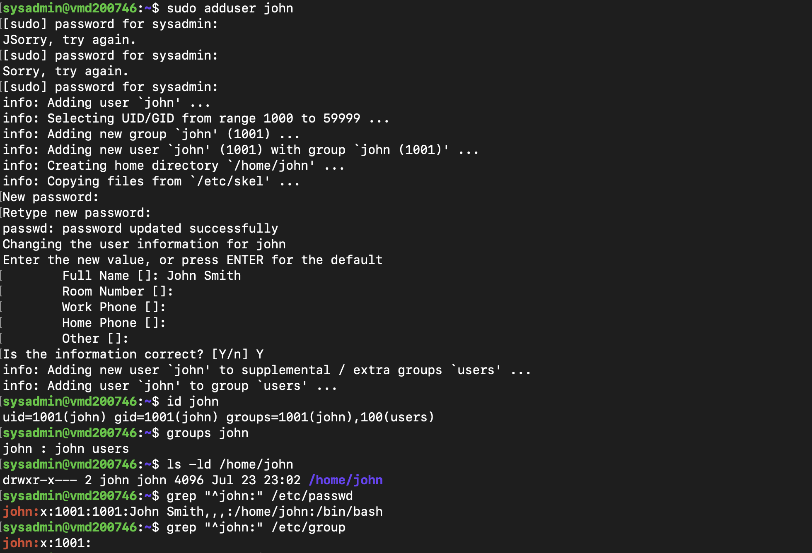
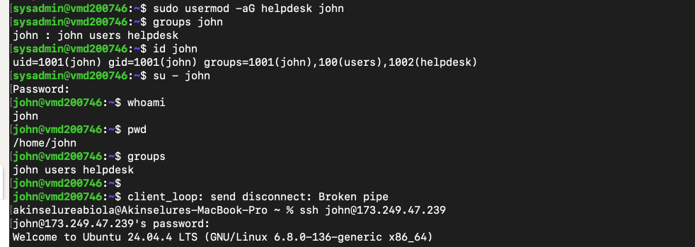
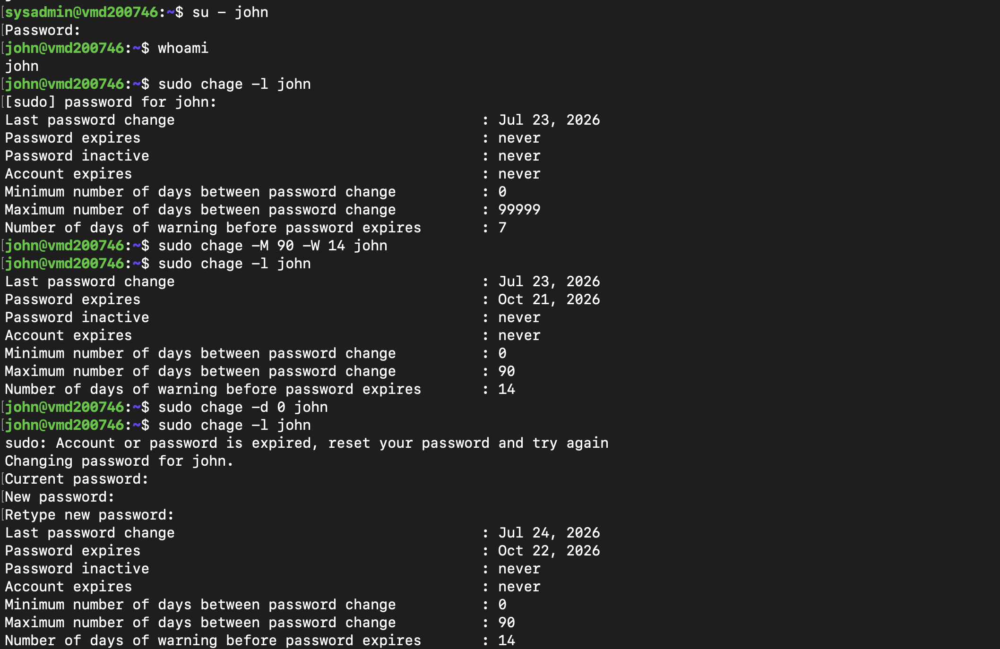
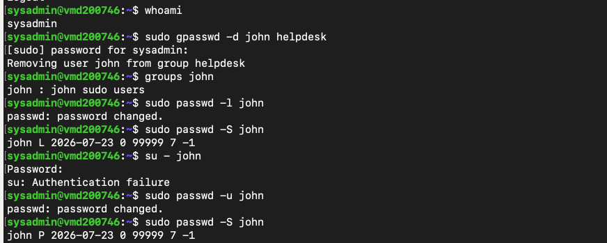
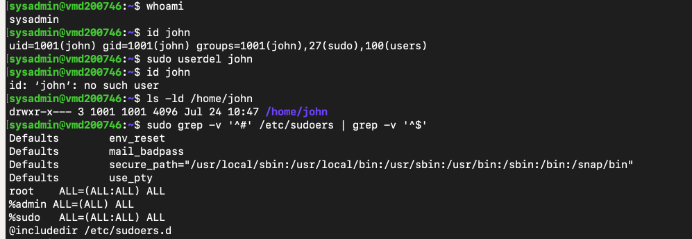
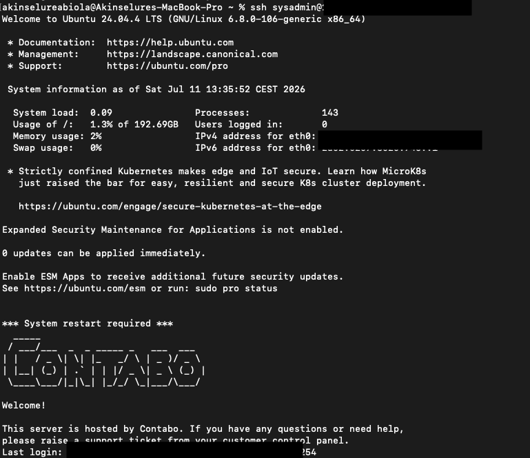
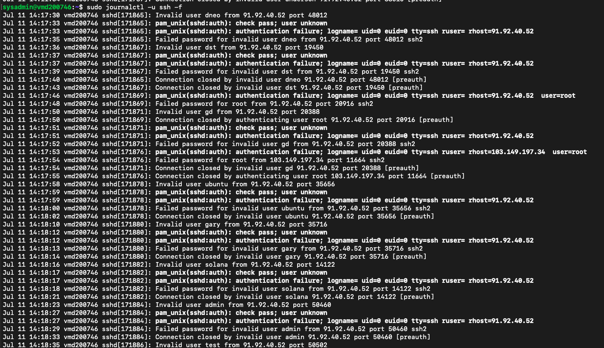

# Lab 03 – Linux User, Group and Sudo Administration

---

# Overview

In this lab, I moved beyond working as the root user and started learning how Linux manages users, groups, permissions and administrative privileges.

I began by creating a dedicated administrator account (`sysadmin`) and then used that account to perform the rest of the exercises. From there, I explored how users are created, how groups are managed, how administrative access is granted, how password policies work, and how user accounts are secured throughout their lifecycle.

This lab gave me a much better understanding of how Linux user administration is handled in real environments rather than just running commands from a tutorial.

---

# Objectives

The goals of this lab were to:

- Create and manage Linux users
- Understand UID, GID and group memberships
- Create and manage Linux groups
- Grant and revoke administrative privileges
- Configure password policies
- Lock and unlock user accounts
- Safely remove user accounts
- Understand how the sudo system works

---

# Environment

- Operating System: Ubuntu Server 24.04 LTS
- Host: Contabo VPS
- Access Method: SSH from macOS Terminal
- Administrator Account: `sysadmin`

---

# Part 1 – Creating an Administrator Account

Rather than continuing to administer the server as the root user, I created a dedicated administrator account.

```bash
sudo adduser sysadmin
```

After creating the account, I added it to the `sudo` group.

```bash
sudo usermod -aG sudo sysadmin
```

I verified the account using:

```bash
id sysadmin

groups sysadmin
```

Then switched into the account.

```bash
su - sysadmin
```

Finally, I confirmed I was working as the new administrator.

```bash
whoami

pwd

sudo whoami
```

This confirmed that I could perform administrative tasks without logging in directly as the root user.

---

# Part 2 – Creating and Managing Users

To understand how Linux handles user accounts, I created a temporary user named `john`.

```bash
sudo adduser john
```

After creating the account, I verified the user information.

```bash
id john

groups john

ls -ld /home/john
```

I also explored the Linux account databases.

```bash
grep "^john:" /etc/passwd

grep "^john:" /etc/group

sudo grep "^john:" /etc/shadow
```

This helped me understand where Linux stores user information, group memberships and encrypted passwords.

---

# Part 3 – Group Management

Next, I created a Helpdesk group.

```bash
sudo addgroup helpdesk
```

I added John to the group.

```bash
sudo usermod -aG helpdesk john
```

Then verified the membership.

```bash
groups john

id john
```

To understand how access changes over time, I also removed John from the Helpdesk group.

```bash
sudo gpasswd -d john helpdesk
```

Verifying the group membership again confirmed that the Helpdesk group had been removed.

---

# Part 4 – Granting Administrative Privileges

I wanted to see how Linux grants administrator access without giving someone the root password.

I added John to the sudo group.

```bash
sudo usermod -aG sudo john
```

After switching to John's account,

```bash
su - john
```

I tested his administrative privileges.

```bash
sudo apt update
```

The command executed successfully, confirming that membership in the `sudo` group was enough to grant administrative access.

---

# Part 5 – Locking and Unlocking User Accounts

Instead of deleting a user immediately, Linux allows administrators to temporarily disable an account.

I locked John's account.

```bash
sudo passwd -l john
```

I checked the account status.

```bash
sudo passwd -S john
```

The account status changed to:

```
L
```

which indicates a locked account.

Attempting to log in as John resulted in an authentication failure.

Afterwards, I unlocked the account.

```bash
sudo passwd -u john
```

Verifying the status again showed:

```
P
```

meaning the account was active again.

---

# Part 6 – Password Policies

I explored how Linux manages password aging using the `chage` command.

First, I inspected John's current password policy.

```bash
sudo chage -l john
```

I then configured a password policy that expires every 90 days with a 14-day warning period.

```bash
sudo chage -M 90 -W 14 john
```

Finally, I forced a password change at the next login.

```bash
sudo chage -d 0 john
```

One interesting thing I observed was that Linux immediately required John to change his password before he could continue working. Seeing this happen made it much easier to understand how password expiration is enforced in enterprise environments.

---

# Part 7 – Removing Users

I tested both ways Linux can remove user accounts.

Deleting only the account:

```bash
sudo userdel john
```

This removed the user while keeping the home directory.

I then created another temporary user and removed both the account and home directory.

```bash
sudo userdel -r tempuser
```

Verifying afterwards confirmed that the home directory had also been removed.

This helped me understand the difference between deleting an account and permanently removing all associated user data.

---

# Part 8 – Understanding sudo

Rather than editing the sudo configuration directly, I inspected the active configuration.

```bash
sudo grep -v '^#' /etc/sudoers | grep -v '^$'
```

The most important line was:

```text
%sudo ALL=(ALL:ALL) ALL
```

This explains why adding a user to the `sudo` group immediately grants administrative privileges.

I also learned that the recommended way to edit the sudo configuration is with `visudo`, since it checks for syntax errors before saving.

---

# What I Learned

This lab taught me much more than how to create Linux users.

I now understand how Linux separates users from administrative privileges, how group membership controls access, how password policies are enforced, and why administrators usually lock accounts before deleting them.

Working through each step on my own VPS made the concepts much easier to understand than simply reading about them.

---

# Key Commands Used

```bash
sudo adduser
sudo usermod
sudo addgroup
sudo gpasswd
groups
id
whoami
pwd
su
passwd
chage
userdel
grep
sudo
```

---

# Screenshots

The screenshots below capture some of the key tasks completed throughout this lab.

## 1. Creating and Verifying a New User

Creating the temporary user (`john`) and verifying the account, group membership, home directory and Linux account information.



---

## 2. Group Management and User Verification

Adding the user to the `helpdesk` group, verifying group membership, switching to the user account and confirming the working environment.



---

## 3. Password Policies and Password Expiration

Viewing password aging information, configuring password expiration, setting warning periods and forcing a password change on next login.



---

## 4. Locking and Unlocking User Accounts

Locking the user account, observing authentication failure, unlocking the account and confirming normal access was restored.



---

## 5. User Deletion and sudo Configuration

Removing user accounts, verifying account removal and reviewing the active `sudo` configuration used to grant administrative privileges.



---

## 6. Connecting to the Ubuntu VPS

Connecting securely to the Ubuntu server over SSH using the dedicated `sysadmin` account before carrying out administrative tasks.



---

## 7. Reviewing SSH Authentication Logs

While working on this lab, I also explored SSH authentication logs using `journalctl`. Seeing repeated login attempts against a public-facing server reinforced why securing SSH and avoiding direct root logins are considered best practices.



---

# Final Thoughts

This has been one of the most practical Linux labs I've completed so far.

Before starting, I knew the basic commands for creating users. By the end of the lab, I understood how Linux manages the complete lifecycle of a user account—from creation, group membership and administrative access through to password policies, account locking and finally account removal.

It's given me a much better appreciation of the day-to-day tasks a Linux system administrator performs and provided a solid foundation for the labs that follow.

---

# Next Steps

In the next lab, I'll move beyond user and group management to continue securing and administering the server. The focus will be on strengthening system security, configuring services, and building the practical skills needed to manage Linux systems in real-world environments.