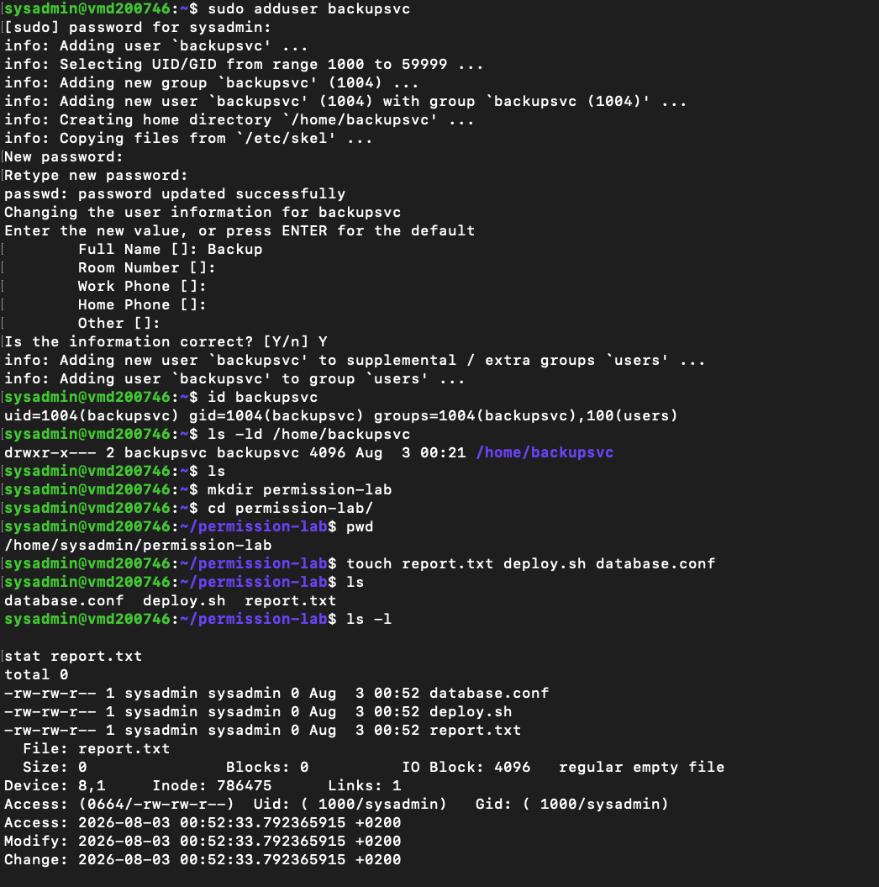
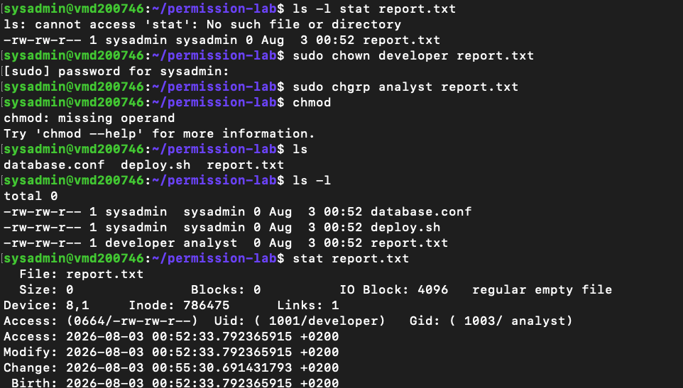
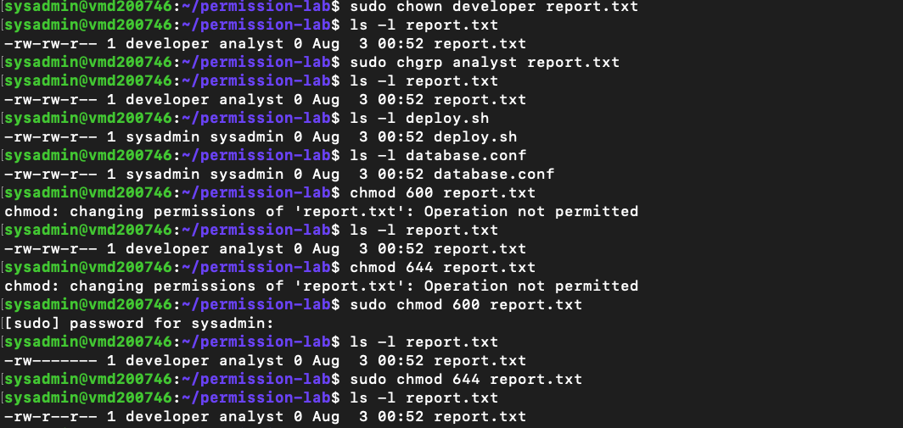
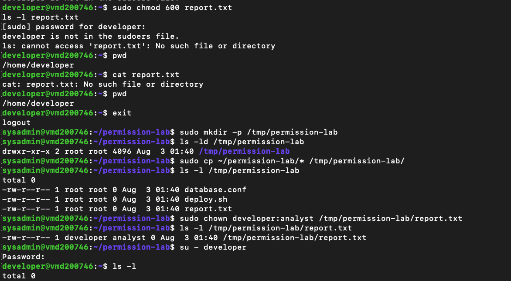

# Lab 04 – Linux File Ownership and Permissions

---

# Overview

After working with Linux users and groups in the previous lab, the next step was understanding how Linux controls access to files.

In this lab, I explored file ownership, group ownership and file permissions. Rather than simply reading about the commands, I created a small workspace on my Ubuntu VPS where I could safely experiment with changing ownership and modifying permissions without affecting any system files.

One thing that stood out during this lab was how closely ownership and permissions are linked. Even though I was logged in as the administrator, Linux still enforced ownership rules and prevented me from changing permissions on a file after I had transferred ownership to another user. Seeing this behaviour first-hand helped me understand why Linux permissions are considered such an important security feature.

---

# Objectives

The goals of this lab were to:

- Understand Linux file ownership
- Understand user and group permissions
- Create a dedicated workspace for testing
- View detailed file information
- Change file ownership
- Change group ownership
- Modify file permissions
- Observe how Linux enforces ownership rules

---

# Environment

- Operating System: Ubuntu Server 24.04 LTS
- Host: Contabo VPS
- Access Method: SSH from macOS Terminal
- Administrator Account: `sysadmin`

---

# Part 1 – Creating a Workspace

Before making any changes, I created a dedicated working directory inside my home folder so I could experiment without affecting any important files.

```bash
mkdir permission-lab
cd permission-lab
pwd
```

The working directory was created successfully.

```
/home/sysadmin/permission-lab
```

Creating a separate workspace made it much easier to keep the lab organised and ensured I wasn't accidentally modifying files elsewhere on the server.

---

# Part 2 – Creating Test Files

To simulate a small project, I created three empty files that I could use throughout the lab.

```bash
touch report.txt deploy.sh database.conf
```

I then listed the directory to verify they had been created.

```bash
ls -l
```

At this point, all three files were owned by the `sysadmin` account because they were created while I was logged in as that user.

---

# Part 3 – Viewing File Information

Before changing anything, I wanted to see what information Linux already stored about one of the files.

I first viewed the file permissions using:

```bash
ls -l report.txt
```

To see more detailed information, I used:

```bash
stat report.txt
```

The output included:

- File owner
- Group owner
- Permission bits
- File size
- Access time
- Modification time
- Change time
- Inode information

I had used `ls -l` before, but `stat` provided much more detail than I expected. It gave me a better understanding of the metadata Linux keeps for every file.

---

# Part 4 – Changing Ownership

To simulate a situation where another user becomes responsible for a file, I changed the ownership of `report.txt` to the `developer` account.

```bash
sudo chown developer report.txt
```

Next, I changed the group ownership to the `analyst` group.

```bash
sudo chgrp analyst report.txt
```

After making both changes, I verified the new ownership.

```bash
ls -l report.txt
```

The output confirmed that the file owner had changed from `sysadmin` to `developer`, while the group owner had changed to `analyst`.

Seeing the ownership change immediately in the directory listing made it much easier to understand the difference between the file owner and the associated group.

---

# Part 5 – Modifying File Permissions

With the ownership changed, I began experimenting with file permissions.

I initially tried to update the permissions using:

```bash
chmod 600 report.txt
```

Instead of changing the permissions, Linux returned:

```
Operation not permitted
```

At first, I expected the command to succeed because I was logged in as `sysadmin`. After reviewing the ownership, I realised that the file now belonged to the `developer` account.

Since I was no longer the file owner, Linux prevented me from changing the permissions without elevated privileges.

Using `sudo` allowed the change to complete successfully.

```bash
sudo chmod 600 report.txt
```

After verifying the result, I restored the permissions to a more common setting.

```bash
sudo chmod 644 report.txt
```

Finally, I confirmed the updated permissions.

```bash
ls -l report.txt
```

This part of the lab was probably the most valuable. Rather than simply reading that only the owner or root can change permissions, I experienced it myself when Linux refused the command.

---

# What I Learned

This lab helped connect several concepts that I had previously thought about separately.

Creating users and groups is only part of Linux administration. Equally important is understanding how ownership and permissions work together to control access to files.

I also learned that Linux strictly enforces ownership rules. Once I transferred ownership of the file to another user, I could no longer change its permissions without using `sudo`.

Using commands such as `ls -l`, `stat`, `chown`, `chgrp` and `chmod` together gave me a much clearer picture of how Linux manages file security.

Working through these exercises on my own VPS made the concepts much easier to understand than simply reading command examples.

---

# Key Commands Used

```bash
mkdir permission-lab
cd permission-lab
pwd

touch report.txt deploy.sh database.conf

ls -l

stat report.txt

sudo chown developer report.txt

sudo chgrp analyst report.txt

chmod 600 report.txt

sudo chmod 600 report.txt

sudo chmod 644 report.txt
```

---

# Screenshots

The screenshots below capture the key tasks completed throughout this lab.

## 1. Creating the Workspace and Test Files

Creating a dedicated working directory and generating the files used throughout the lab.



---

## 2. Viewing File Metadata

Using the `stat` command to examine detailed file information, including ownership, permissions and timestamps.



---

## 3. Changing File Ownership

Changing the file owner to `developer` and the group owner to `analyst`, then verifying the changes.



---

## 4. Modifying File Permissions

Attempting to change file permissions, observing the permission error, and successfully updating the permissions using `sudo`.



---

# Final Thoughts

Although the commands used in this lab were relatively simple, the behaviour behind them was very useful to see in practice.

The biggest takeaway for me was that ownership matters just as much as permissions. Once ownership changed, Linux immediately enforced those rules and prevented further changes until administrative privileges were used.

This lab gave me a much better understanding of how Linux protects files and why correctly managing ownership and permissions is such an important responsibility for system administrators.

---

# Next Steps

In the next lab, I'll build on these permission concepts by exploring **Access Control Lists (ACLs)**. Unlike traditional Linux permissions, ACLs allow permissions to be assigned to multiple individual users, providing more flexible access control for shared files and directories.