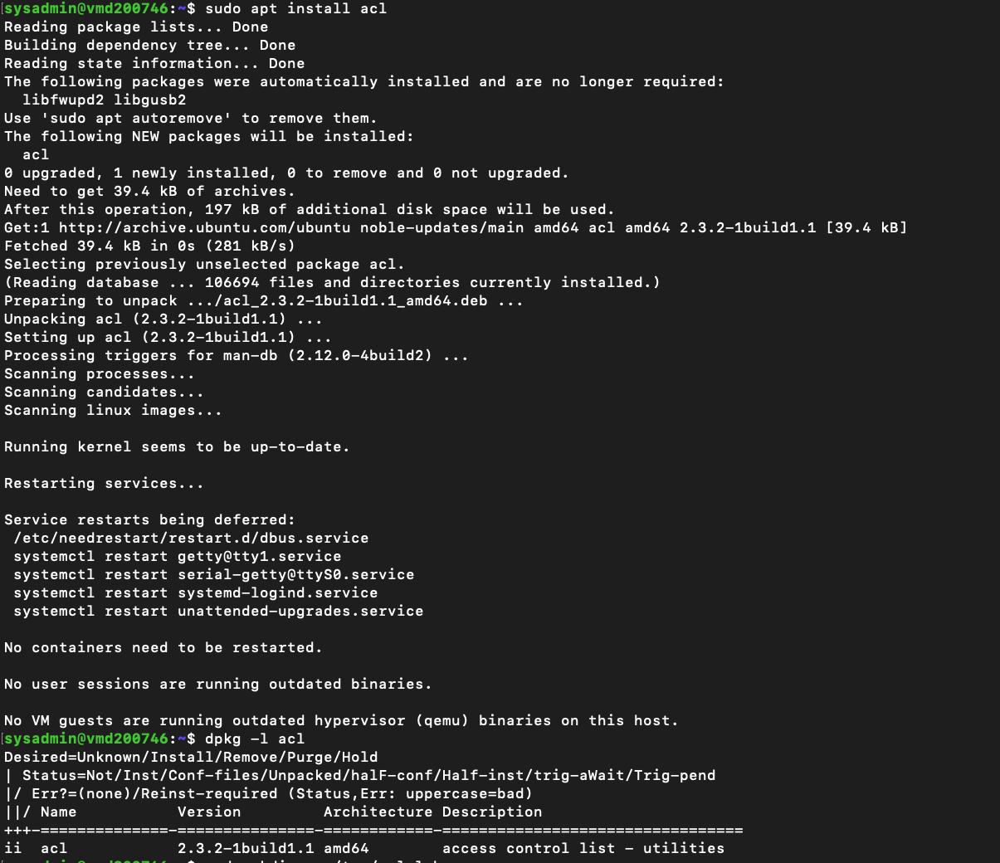
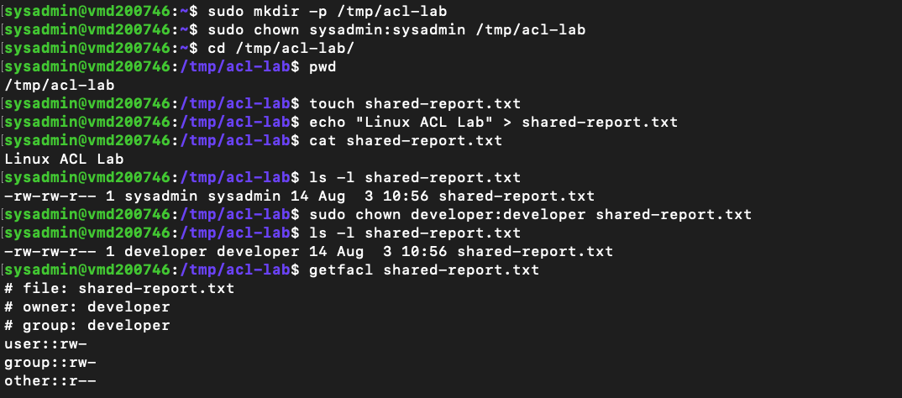
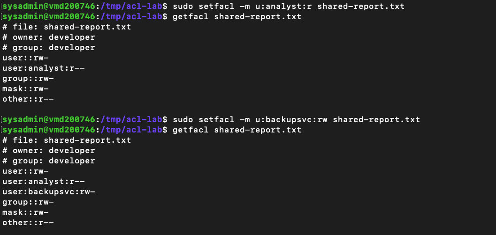
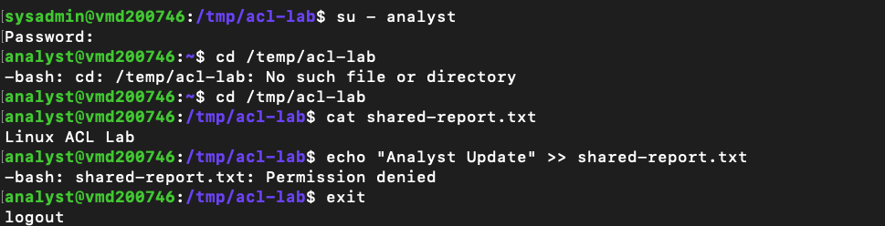
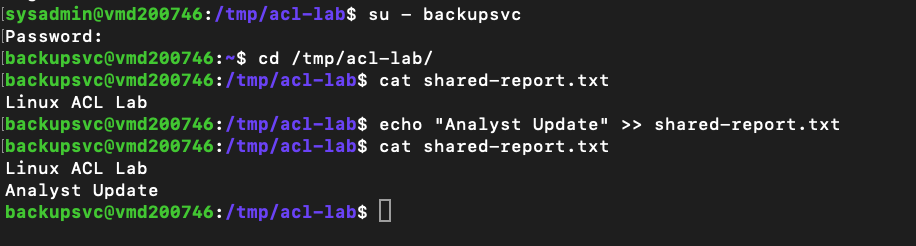

# Lab 05 – Access Control Lists (ACLs)

---

# Overview

In the previous lab, I worked with traditional Linux file ownership and permissions. While those permissions are suitable for many situations, they also have limitations. A file can only have one owner, one group and a single set of permissions for everyone else.

In this lab, I explored Access Control Lists (ACLs), which provide a more flexible way to manage access to files. Instead of changing the owner or group each time another user needs access, ACLs allow permissions to be assigned directly to individual users.

Working through this lab helped me understand why ACLs are commonly used in enterprise environments where multiple users need different levels of access to the same file.

---

# Objectives

The goals of this lab were to:

- Install and verify ACL support on Ubuntu
- Create a dedicated workspace for testing ACLs
- Create and manage a shared file
- View existing ACL entries
- Assign user-specific permissions using ACLs
- Verify ACL configuration
- Test file access using different Linux user accounts
- Understand how ACLs extend traditional Linux permissions

---

# Environment

- Operating System: Ubuntu Server 24.04 LTS
- Host: Contabo VPS
- Access Method: SSH from macOS Terminal
- Administrator Account: `sysadmin`

---

# Part 1 – Installing ACL Support

Before using ACL commands, I first checked whether the ACL package was already installed.

```bash
dpkg -l acl
```

The output showed that the package was not installed.

I then installed it using APT.

```bash
sudo apt install acl
```

Once the installation completed, I verified it again.

```bash
dpkg -l acl
```

The package was now listed as installed and ready to use.

---

# Part 2 – Creating a Workspace

To keep the lab separate from the rest of the server, I created a temporary working directory.

```bash
sudo mkdir -p /tmp/acl-lab

sudo chown sysadmin:sysadmin /tmp/acl-lab

cd /tmp/acl-lab

pwd
```

The working directory was successfully created.

```
/tmp/acl-lab
```

Using a dedicated workspace made it easy to experiment without affecting other files on the server.

---

# Part 3 – Creating a Test File

Inside the workspace, I created a simple text file that would be shared between multiple users.

```bash
touch shared-report.txt

echo "Linux ACL Lab" > shared-report.txt
```

I confirmed the contents using:

```bash
cat shared-report.txt
```

Output:

```
Linux ACL Lab
```

I also viewed the current file ownership.

```bash
ls -l shared-report.txt
```

At this point, the file belonged to the `sysadmin` account because it had just been created.

---

# Part 4 – Changing the File Owner

For this exercise, I wanted another user to own the file before assigning additional permissions.

I changed the ownership to the `developer` account.

```bash
sudo chown developer:developer shared-report.txt
```

I then verified the change.

```bash
ls -l shared-report.txt
```

The output confirmed that both the owner and group had changed to `developer`.

Changing the ownership first made it easier to understand that ACLs work alongside normal Linux ownership rather than replacing it.

---

# Part 5 – Viewing Existing ACL Entries

Before adding any new permissions, I checked the current ACL information.

```bash
getfacl shared-report.txt
```

The output only showed the standard owner, group and other permissions.

This served as a useful baseline before adding additional ACL entries.

---

# Part 6 – Granting Additional User Permissions

Next, I assigned read-only access to the `analyst` account.

```bash
sudo setfacl -m u:analyst:r shared-report.txt
```

Afterwards, I granted both read and write access to the `backupsvc` account.

```bash
sudo setfacl -m u:backupsvc:rw shared-report.txt
```

To verify both changes, I displayed the ACL information again.

```bash
getfacl shared-report.txt
```

The output now showed additional ACL entries for both users.

Seeing the extra entries appear underneath the standard permissions made it much easier to understand how ACLs extend the traditional Linux permission model.

---

# Part 7 – Verifying Access

Rather than assuming the ACLs were working correctly, I tested them using the actual user accounts.

## Testing the Analyst Account

I switched to the `analyst` account.

```bash
su - analyst
```

After navigating to the lab directory, I displayed the file.

```bash
cat shared-report.txt
```

The file opened successfully.

Next, I attempted to append new text.

```bash
echo "Analyst Update" >> shared-report.txt
```

Linux responded with:

```
Permission denied
```

This confirmed that the ACL correctly limited the `analyst` account to read-only access.

---

## Testing the Backup Service Account

Next, I switched to the `backupsvc` account.

```bash
su - backupsvc
```

After navigating back to the lab directory, I displayed the file.

```bash
cat shared-report.txt
```

The file contents were displayed successfully.

I then attempted to append new text.

```bash
echo "Analyst Update" >> shared-report.txt
```

Unlike the previous test, the command completed successfully.

Displaying the file again confirmed that the new line had been added.

```bash
cat shared-report.txt
```

Output:

```
Linux ACL Lab
Analyst Update
```

This confirmed that the ACL granted both read and write permissions to the `backupsvc` account.

Seeing both user accounts behave differently against the same file was probably the most useful part of the lab because it clearly demonstrated how ACLs provide more granular access control.

---

# What I Learned

This lab showed me that traditional Linux permissions are not always enough when several users need different levels of access to the same file.

Before working through these exercises, I assumed changing the owner or group was the only way to grant access. ACLs demonstrated a much more flexible approach by allowing permissions to be assigned directly to individual users while leaving the original ownership unchanged.

Testing the permissions by switching between different user accounts made the behaviour much easier to understand than simply reading the command documentation.

---

# Key Commands Used

```bash
dpkg -l acl

sudo apt install acl

sudo mkdir -p /tmp/acl-lab

sudo chown sysadmin:sysadmin /tmp/acl-lab

cd /tmp/acl-lab

touch shared-report.txt

echo "Linux ACL Lab" > shared-report.txt

ls -l shared-report.txt

sudo chown developer:developer shared-report.txt

getfacl shared-report.txt

sudo setfacl -m u:analyst:r shared-report.txt

sudo setfacl -m u:backupsvc:rw shared-report.txt

su - analyst

su - backupsvc

cat shared-report.txt
```

---

# Screenshots

The screenshots below capture the key tasks completed throughout this lab.

## 1. Installing the ACL Package

Checking whether ACL support was installed, installing the package and verifying the installation.



---

## 2. Creating the Workspace and Test File

Creating the working directory, creating the shared file and verifying the initial file ownership.



---

## 3. Viewing and Updating ACL Entries

Viewing the initial ACL configuration, changing the file owner and assigning additional permissions to individual users.



---

## 4. Verifying ACL Permissions

Testing the ACL by switching to the `analyst` account and confirming that read access worked while write access was denied.



---

## 5. Testing Read and Write Access

Switching to the `backupsvc` account, successfully appending data to the file and verifying the updated contents.



---

# Final Thoughts

This lab built naturally on the previous one by showing that Linux permissions don't stop with ownership and `chmod`.

Access Control Lists provide an additional layer of flexibility that allows administrators to grant different levels of access to individual users without changing the file owner or primary group.

Working through the exercises on my own VPS made the behaviour much easier to understand, especially after testing the permissions with different user accounts and seeing the expected results first-hand.

---

# Next Steps

In the next lab, I'll move on to **Package Management (APT)**, where I'll explore how software is installed, updated and maintained on Ubuntu systems. Keeping packages up to date is one of the routine responsibilities of a Linux system administrator and forms an important part of maintaining a secure server.