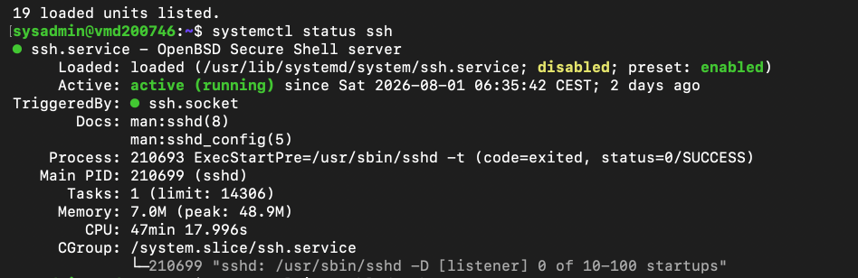
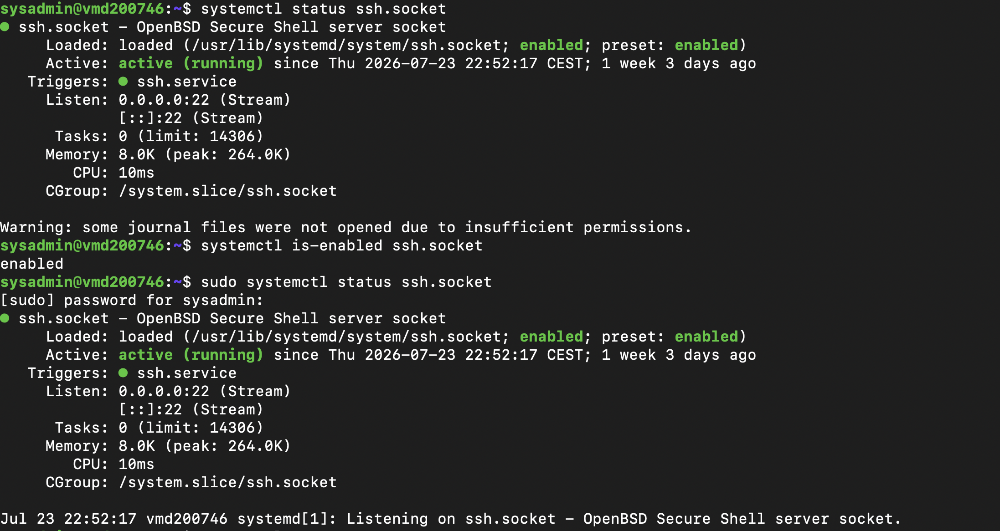
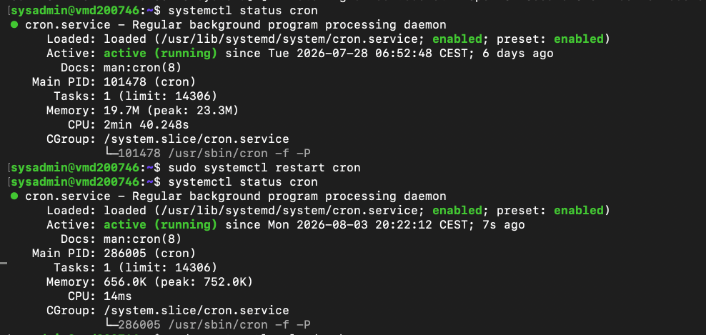
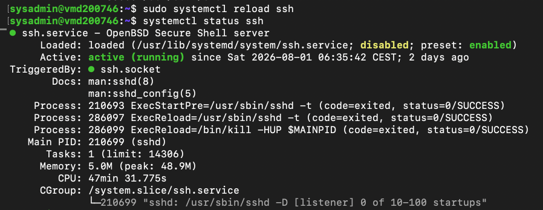

# Lab 07 – Systemd Services

---

# Overview

In this lab, I explored how Ubuntu manages background services using **systemd**, the system and service manager used by modern Linux distributions.

Rather than only learning a few `systemctl` commands, I wanted to understand how services are managed throughout their lifecycle—how to inspect their status, determine whether they start automatically during boot, restart them safely, and reload their configuration without interrupting active connections.

One of the most interesting discoveries came while investigating the SSH service. Even though I was connected to the server through SSH, the service itself appeared as **disabled**. Looking into this further introduced me to **socket activation**, a feature of systemd that starts certain services only when they are needed. It was something I hadn't encountered before and made this lab much more valuable than simply practising commands.

---

# Objectives

The goals of this lab were to:

- Understand the role of systemd in Linux
- View the status of running services
- Check whether services start automatically during boot
- Restart and reload services
- Understand the difference between restarting and reloading a service
- Learn how socket activation works
- Become familiar with common `systemctl` commands

---

# Environment

- Operating System: Ubuntu Server 24.04 LTS
- Host: Contabo VPS
- Access Method: SSH from macOS Terminal
- Administrator Account: `sysadmin`

---

# Part 1 – Exploring Systemd

I began by checking the version of systemd installed on the server.

```bash
systemctl --version
```

This confirmed that Ubuntu was using systemd as its init system.

Next, I listed the active systemd units.

```bash
systemctl list-units
```

This displayed the services, sockets, timers and other units currently loaded into memory.

Seeing how many services were already running in the background gave me a better appreciation of everything systemd manages behind the scenes.

---

# Part 2 – Checking Service Status

The first service I inspected was the SSH service.

```bash
systemctl status ssh
```

The output included useful information such as:

- Service description
- Current state
- Main process ID (PID)
- Memory usage
- CPU usage
- Recent log entries

Being able to view all of this information with a single command makes troubleshooting much easier than trying to inspect individual processes manually.

---

# Part 3 – Checking Whether a Service Starts at Boot

Next, I wanted to see whether SSH was configured to start automatically when the server boots.

```bash
systemctl is-enabled ssh
```

To my surprise, the result was:

```text
disabled
```

At first this seemed confusing because I was already connected to the server using SSH.

Instead of assuming something was wrong, I decided to investigate further.

---

# Part 4 – Investigating SSH Socket Activation

I checked the SSH socket instead of the SSH service.

```bash
systemctl status ssh.socket

systemctl is-enabled ssh.socket
```

This showed that the socket was active and enabled.

After reading through the service information, I learned that Ubuntu 24.04 uses **socket activation** for OpenSSH.

Rather than starting the SSH service during boot, systemd starts the SSH socket first. The socket listens for incoming connections on port 22 and automatically starts the SSH service whenever someone connects.

Understanding this behaviour explained why the SSH service appeared disabled while SSH itself continued working normally.

This was probably the biggest takeaway from the entire lab because it reinforced the importance of investigating unexpected behaviour instead of immediately assuming something is broken.

---

# Part 5 – Restarting a Service

To practise service management safely, I used the Cron service.

First, I checked its current status.

```bash
systemctl status cron
```

I then restarted the service.

```bash
sudo systemctl restart cron
```

Running the status command again showed that the service had restarted successfully and the "Active since" timestamp had changed.

This confirmed that the restart had completed successfully.

---

# Part 6 – Reloading a Service

Restarting a service completely stops and starts it again.

Reloading is different because it applies configuration changes without interrupting the running process whenever the service supports it.

To see this in practice, I reloaded the SSH service.

```bash
sudo systemctl reload ssh
```

Afterwards, I checked the service status again.

```bash
systemctl status ssh
```

The service remained active throughout the reload process while applying the configuration changes.

Understanding the difference between restarting and reloading is useful because reloading often avoids unnecessary downtime on production systems.

---

# What I Learned

Before this lab, I mainly thought of services as programs running quietly in the background.

Working through these exercises helped me understand that systemd is responsible for managing every stage of a service's lifecycle, from starting during boot to monitoring its health and handling configuration changes.

The most valuable lesson came from investigating why the SSH service appeared disabled even though SSH was working perfectly. Learning about socket activation showed me that command output doesn't always tell the full story unless you understand how the service is designed to operate.

Working through the investigation on my own VPS made the concept much easier to understand than simply reading about it.

---

# Key Commands Used

```bash
systemctl --version
systemctl list-units
systemctl status
systemctl is-enabled
systemctl restart
systemctl reload
```

---

# Screenshots

The screenshots below capture the key stages of this lab.

## 1. Viewing the SSH Service

Checking the status of the SSH service and observing that it was active even though it appeared disabled.

```text
systemctl status ssh
systemctl is-enabled ssh
```

# Screenshots

The screenshots below capture the key stages of this lab.

## 1. Viewing the SSH Service

Checking the status of the SSH service and observing that it was active even though it initially appeared to be disabled.



---

## 2. Investigating SSH Socket Activation

Inspecting the SSH socket and confirming that it was enabled while handling incoming SSH connections through socket activation.



---

## 3. Restarting the Cron Service

Restarting the Cron service and verifying that the service restarted successfully by checking its updated status.



---

## 4. Reloading the SSH Service

Reloading the SSH service configuration and confirming that the service remained active without interrupting the running service.



---

# Final Thoughts

This lab gave me a much better understanding of how Linux manages services behind the scenes.

Although the `systemctl` commands themselves were straightforward, the investigation into why SSH appeared disabled turned out to be the most valuable part of the exercise. Discovering how socket activation works helped me realise that interpreting command output often requires understanding the technology behind it rather than taking the output at face value.

Working through the lab on a real VPS also made the experience feel much more practical, especially since these are the same commands a Linux administrator would use when checking the health of production services.

---

# Next Steps

In the next lab, I'll move on to **Journalctl and Log Analysis**, where I'll learn how to inspect system logs, investigate service activity and use log files to troubleshoot problems on a Linux server.
