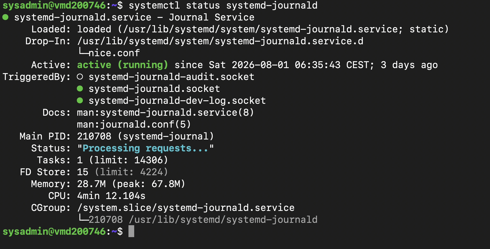
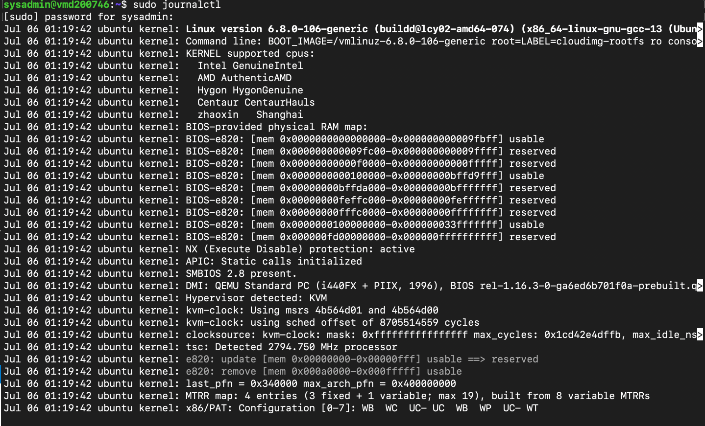
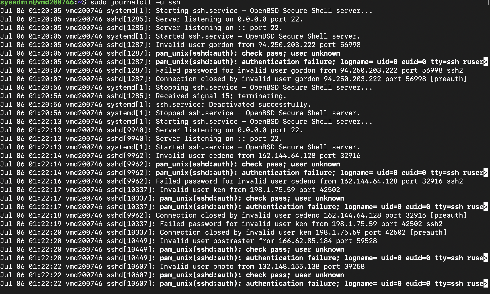
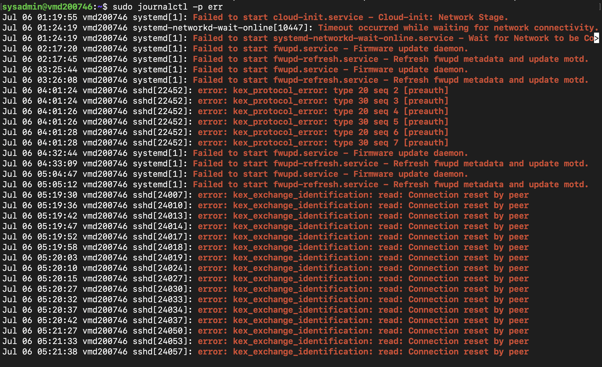
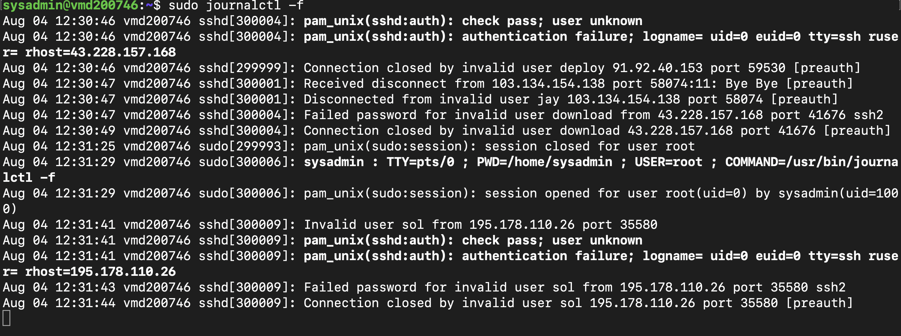
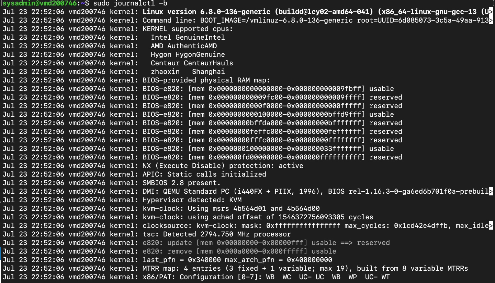

# Lab 08 – Journalctl & Linux Log Analysis

---

# Overview

After learning how Linux manages services with systemd in the previous lab, the next step was understanding how those services record information and how administrators investigate system activity when something goes wrong.

In this lab, I explored Linux logging using **systemd-journald** and the `journalctl` command. Rather than simply viewing log files, I learned how to inspect service activity, filter logs by time and severity, monitor logs in real time and investigate authentication events on my Ubuntu VPS.

One thing that stood out during this lab was discovering that my VPS was constantly receiving automated SSH login attempts from the internet. Watching these events appear live reinforced how valuable system logs are for understanding what is happening on a server and why reviewing logs is one of the first steps when troubleshooting Linux systems.

---

# Objectives

The goals of this lab were to:

- Understand how Linux system logging works
- Verify that the Journal Service is running
- View system logs using `journalctl`
- Investigate service-specific logs
- Filter logs by date and priority
- Monitor logs in real time
- View boot logs
- Identify failed authentication attempts
- Understand how logs help with troubleshooting

---

# Environment

- Operating System: Ubuntu Server 24.04 LTS
- Host: Contabo VPS
- Access Method: SSH from macOS Terminal
- Administrator Account: `sysadmin`

---

# Part 1 – Verifying the Journal Service

Before working with logs, I confirmed that the Journal Service responsible for collecting system logs was running.

```bash
systemctl status systemd-journald
```

The output showed that the service was active and running successfully.

This confirmed that Ubuntu was already collecting logs from the operating system, services, applications and the Linux kernel.

---

# Part 2 – Viewing System Logs

Next, I explored the journal itself.

```bash
journalctl
```

This displayed the available log entries collected by the system.

Since I was running the command as a standard user, Linux informed me that some system logs required elevated privileges.

To view the complete journal, I used:

```bash
sudo journalctl
```

This displayed the full journal, including kernel messages and other system-wide events.

Working through both commands helped me understand the difference between viewing logs as a normal user and as an administrator.

---

# Part 3 – Filtering Log Entries

Linux systems generate a large number of log entries, so being able to filter the output is essential.

To display the newest events first, I used:

```bash
journalctl -r
```

This reversed the order of the journal, making it much easier to investigate recent activity.

I also displayed only today's log entries.

```bash
sudo journalctl --since today
```

Filtering the journal by date reduced the amount of information displayed and made it easier to focus on current events.

---

# Part 4 – Investigating SSH Logs

Rather than reviewing every system log, I focused on the SSH service.

```bash
sudo journalctl -u ssh
```

The output showed SSH-related events including:

- Successful logins
- Connection closures
- Failed authentication attempts
- Invalid usernames

Being able to isolate logs for a single service demonstrated why `journalctl` is such an effective troubleshooting tool.

---

# Part 5 – Filtering Error Messages

Instead of reading every log entry, I filtered the journal to display only error-level messages.

```bash
sudo journalctl -p err
```

This highlighted various error messages generated by the system.

Filtering by priority showed how administrators can quickly focus on potential problems without searching through thousands of log entries manually.

---

# Part 6 – Monitoring Logs in Real Time

One of the most interesting parts of the lab was monitoring the journal as new events occurred.

```bash
sudo journalctl -f
```

While watching the live logs, I noticed repeated SSH authentication attempts from unknown IP addresses.

The journal displayed entries such as:

- Failed password
- Invalid user
- Authentication failure
- Connection closed

At first, I expected to see only my own SSH activity. After reviewing the logs more carefully, I realised these were automated bots attempting to access publicly accessible Linux servers.

Fortunately, every authentication attempt was rejected by the SSH service.

Seeing these events appear in real time gave me a much better appreciation of how Linux logs can be used to monitor system security.

---

# Part 7 – Viewing Boot Logs

Finally, I explored the logs generated during the current system boot.

```bash
sudo journalctl -b
```

The output included information about:

- Linux kernel startup
- Hardware detection
- Memory initialization
- Boot parameters
- System startup

Seeing the boot process recorded in the journal helped me understand how Linux documents everything that happens while the server starts.

---

# What I Learned

This lab showed me that Linux logging is much more than simply recording system events.

I learned how to investigate individual services, filter logs by date and priority, monitor systems in real time and review boot activity.

The most valuable part of the lab was watching live SSH authentication attempts against my VPS. Seeing those events appear as they happened reinforced why reviewing logs is such an important part of Linux administration and system security.

Working through these exercises on my own server made the concepts much easier to understand than simply reading about them.

---

# Key Commands Used

```bash
systemctl status systemd-journald

journalctl

sudo journalctl

journalctl -r

sudo journalctl --since today

sudo journalctl -u ssh

sudo journalctl -p err

sudo journalctl -f

sudo journalctl -b
```

---

# Screenshots

The screenshots below capture the key tasks completed throughout this lab.

## 1. Verifying the Journal Service

Confirming that the Journal Service was active and responsible for collecting system logs.



---

## 2. Viewing the System Journal

Displaying system log entries collected by `systemd-journald`.



---

## 3. Investigating SSH Logs

Filtering the journal to display only SSH-related log entries.



---

## 4. Filtering Error Messages

Displaying only error-level log entries to identify potential problems.



---

## 5. Monitoring Logs in Real Time

Watching new journal entries appear live while observing automated SSH authentication attempts.



---

## 6. Viewing Boot Logs

Reviewing the log entries generated during the most recent system boot.



---

# Final Thoughts

This lab gave me a much better understanding of how Linux administrators use logs to investigate systems and troubleshoot problems.

Although the `journalctl` commands themselves were straightforward, seeing real authentication attempts against my VPS was the highlight of the lab. It reinforced that logs are more than historical records—they provide valuable insight into how a system is behaving at any given moment.

Working through the exercises on a live Ubuntu server made the experience much more practical and helped me understand why log analysis is considered a core skill for Linux system administrators.

---

# Next Steps

In the next lab, I'll move on to **Process Management**, where I'll learn how Linux manages running processes, monitor system resources and safely control processes from the command line.