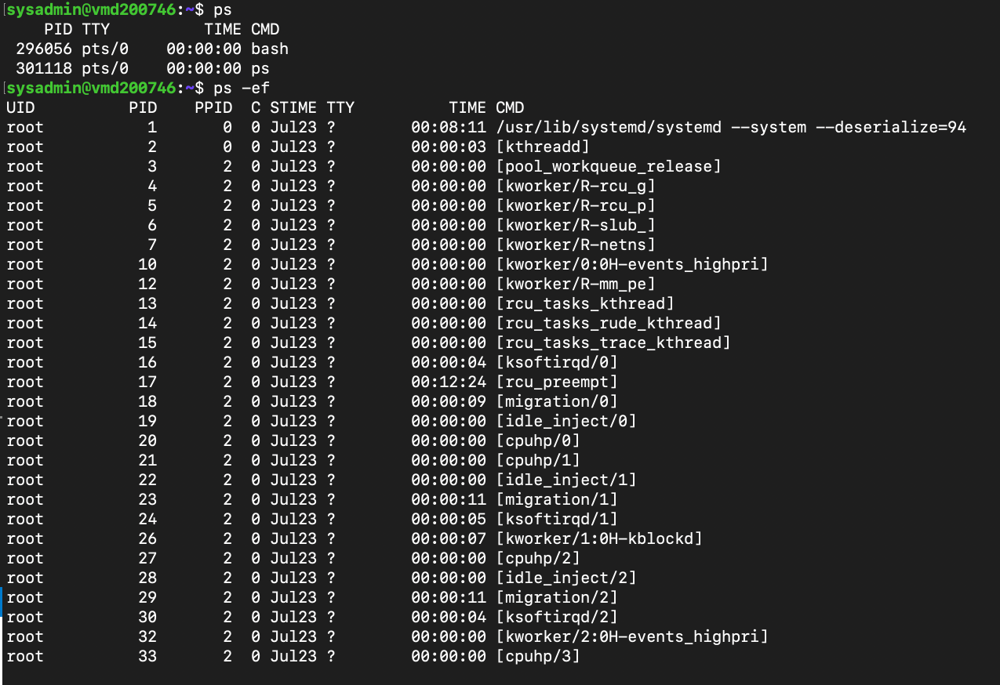
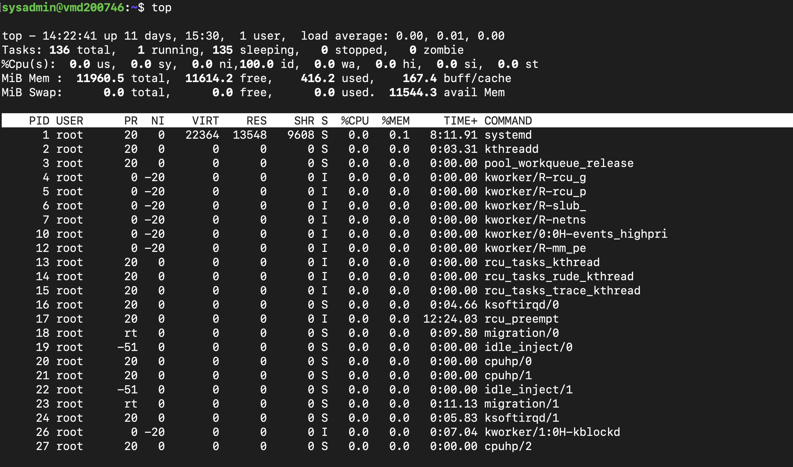
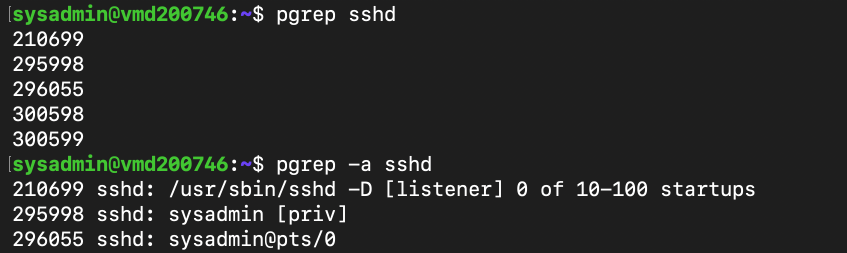
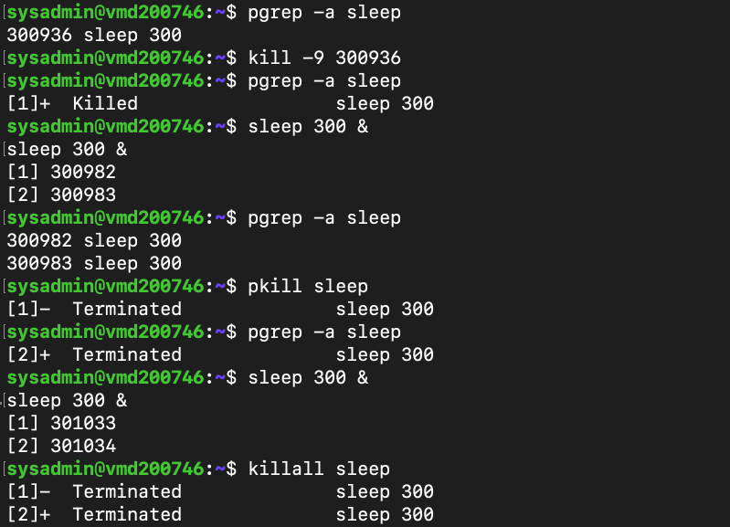
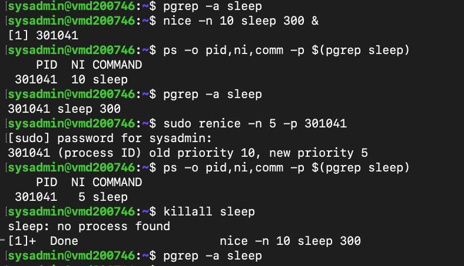

# Lab 09 – Linux Process Management

---

# Overview

In this lab, I explored how Linux manages running processes and how administrators monitor and control them.

Rather than simply listing running processes, I wanted to understand how to identify active processes, monitor system resource usage, search for specific processes, terminate them safely, and adjust their scheduling priority.

One thing that stood out during this lab was the difference between gracefully stopping a process and forcefully terminating one. Creating my own test processes made it much easier to understand how commands such as `kill`, `pkill`, `killall`, `nice`, and `renice` are used in real administration tasks instead of just reading about them.

---

# Objectives

The goals of this lab were to:

- Understand Linux processes
- View running processes
- Monitor CPU and memory usage
- Search for specific processes
- Terminate processes safely
- Understand the difference between `SIGTERM` and `SIGKILL`
- Kill processes by name
- Adjust process priority
- Understand Linux scheduling priorities

---

# Environment

- Operating System: Ubuntu Server 24.04 LTS
- Host: Contabo VPS
- Access Method: SSH from macOS Terminal
- Administrator Account: `sysadmin`

---

# Part 1 – Viewing Running Processes

I started by exploring the processes currently running on the server.

First, I viewed only the processes associated with my current terminal session.

```bash
ps
```

This displayed my current Bash shell and the `ps` command itself.

Next, I viewed every running process on the server.

```bash
ps -ef
```

The output included system services, kernel threads, SSH sessions and many background processes that keep Linux operating normally.

Seeing the difference between `ps` and `ps -ef` helped me understand that Linux is constantly running many processes behind the scenes, even when very little appears to be happening.

---

# Part 2 – Monitoring the System in Real Time

Next, I monitored the server using the `top` command.

```bash
top
```

Unlike `ps`, which provides a snapshot, `top` continuously refreshes the display.

It allowed me to observe:

- CPU usage
- Memory usage
- Load average
- Running processes
- Process IDs (PIDs)
- Process priorities

One thing I noticed was that my VPS was almost idle. CPU usage remained close to 100% idle, memory usage was low, and there were no zombie processes.

This gave me a better understanding of how to quickly assess the health of a Linux server.

---

# Part 3 – Finding Specific Processes

Instead of manually searching through a long process list, I used `pgrep` to locate SSH processes.

```bash
pgrep sshd
```

This returned the Process IDs (PIDs) of the running SSH processes.

To display more information, I ran:

```bash
pgrep -a sshd
```

This showed the PID together with the command responsible for each process.

I could clearly identify:

- The SSH listener
- The privileged SSH authentication process
- My active SSH session

This made it much easier to understand how multiple SSH-related processes work together whenever someone connects to the server.

---

# Part 4 – Gracefully Terminating a Process

To practise process management safely, I created a temporary background process.

```bash
sleep 300 &
```

I confirmed that it was running.

```bash
pgrep -a sleep
```

Next, I terminated the process using:

```bash
kill <PID>
```

This sends a **SIGTERM** signal, allowing the process to exit cleanly.

Afterwards, I verified that the process had stopped.

```bash
pgrep -a sleep
```

Working through this exercise showed me why administrators normally use `kill` before resorting to more aggressive methods.

---

# Part 5 – Forcefully Terminating a Process

To understand the difference between graceful and forced termination, I created another background process.

```bash
sleep 300 &
```

This time I terminated it using:

```bash
kill -9 <PID>
```

This sends a **SIGKILL** signal.

Unlike `SIGTERM`, the process is immediately stopped without having the opportunity to perform any cleanup.

Although both commands stopped the process successfully, I learned that `kill -9` should generally be reserved for situations where a process refuses to terminate normally.

---

# Part 6 – Killing Processes by Name

Instead of terminating processes individually by PID, I created two `sleep` processes.

```bash
sleep 300 &
sleep 300 &
```

I confirmed they were running.

```bash
pgrep -a sleep
```

Then I used:

```bash
pkill sleep
```

Both processes terminated immediately.

I repeated the exercise using:

```bash
killall sleep
```

Again, Linux successfully terminated every running process named `sleep`.

This demonstrated that `pkill` and `killall` are useful when multiple instances of the same application are running.

---

# Part 7 – Managing Process Priority

Finally, I explored Linux process priorities.

I started a process with a lower scheduling priority.

```bash
nice -n 10 sleep 300 &
```

I verified the Nice value.

```bash
ps -o pid,ni,comm -p $(pgrep sleep)
```

The output showed a Nice value of:

```text
10
```

Next, I modified the priority of the running process.

```bash
sudo renice -n 5 -p <PID>
```

Verifying the process again confirmed that the Nice value had changed to:

```text
5
```

This exercise helped me understand how Linux allocates CPU time to processes and how administrators can adjust scheduling priorities when needed.

---

# What I Learned

This lab helped me understand that process management involves much more than simply viewing running applications.

I learned how Linux identifies processes using PIDs, how to monitor system performance, how to safely terminate processes, and how process priorities influence CPU scheduling.

One of the most useful lessons was understanding the difference between `SIGTERM` and `SIGKILL`. Although both stop a process, they behave very differently, and knowing when to use each one is an important part of system administration.

Working through these exercises on my own VPS made the concepts much easier to understand than simply reading command examples.

---

# Key Commands Used

```bash
ps
ps -ef
top
pgrep
kill
kill -9
pkill
killall
nice
renice
```

---

# Screenshots

The screenshots below capture the key tasks completed throughout this lab.

## 1. Viewing Running Processes

Using `ps` and `ps -ef` to compare processes running in the current terminal with all processes running on the system.



---

## 2. Monitoring System Resources

Using `top` to monitor CPU usage, memory usage, system load and active processes in real time.



---

## 3. Searching for SSH Processes

Using `pgrep` to locate running SSH processes and display their associated commands.



---

## 4. Managing Process Termination

Creating background processes, terminating them with `kill`, `kill -9`, `pkill` and `killall`, and verifying that they had stopped successfully.



---

## 5. Managing Process Priority

Creating a process with a custom Nice value and updating its scheduling priority using `renice`.



---

# Final Thoughts

This has been one of the most practical Linux administration labs so far.

Before this lab, I understood that Linux applications run as processes, but I hadn't fully appreciated how administrators monitor, manage and control them. Creating my own processes, monitoring them in real time, adjusting their priorities and terminating them safely made the concepts much more meaningful than simply reading about the commands.

I also found it valuable to see how many of the services explored in earlier labs—such as SSH, systemd and journald—appeared as active processes. It reinforced how each lab builds on the previous one and helped me connect the different areas of Linux administration together.

---

# Next Steps

In the next lab, I'll focus on **UFW (Uncomplicated Firewall)** to learn how Linux controls incoming and outgoing network traffic, configure firewall rules, and secure a server by allowing only the services that should be accessible.