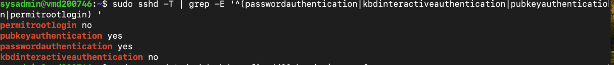
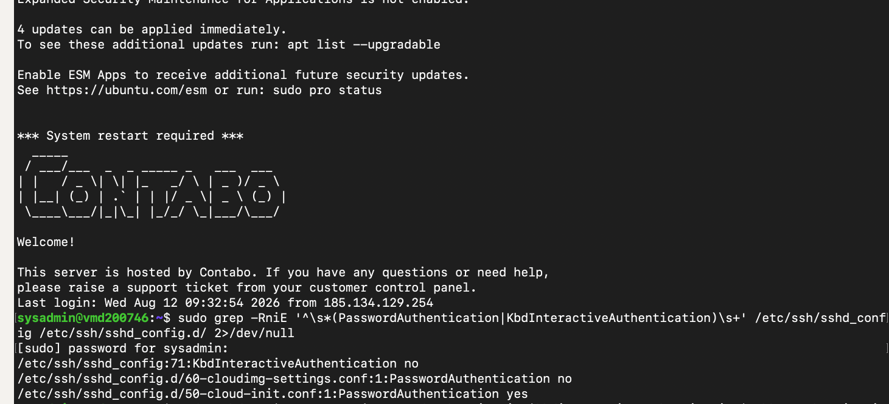
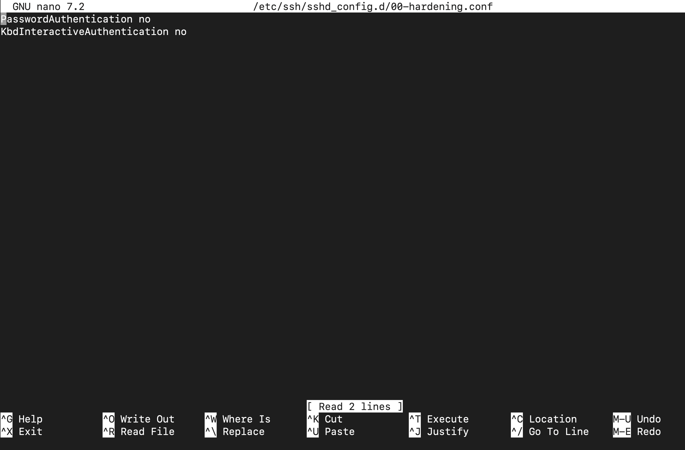
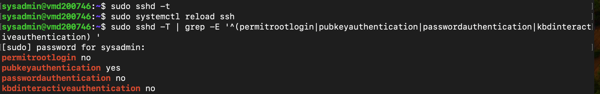
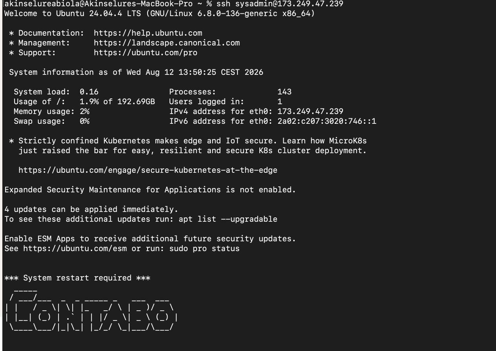

## Lab 13 – Linux Security Audit

# Overview

This was the next step after my Fail2Ban lab. This time, instead of focusing on one security tool, I wanted to look at the server as a whole and see what was actually exposed, how SSH was configured, what the logs were showing, and whether the security controls I had already put in place were doing their job.

I'm working with an Ubuntu 24.04 LTS VPS hosted by Contabo and accessing it remotely from my Mac using SSH.

One of the most useful parts of this lab was finding something I didn't expect: SSH key authentication was working, but password authentication was still effectively enabled because of another configuration file loaded by cloud-init.

That gave me a real security issue to investigate rather than just following a checklist.

What I wanted to check

For this audit, I looked at:

The server's identity and current user

Network interfaces and routing

Internet connectivity and DNS resolution

Listening services and exposed ports

SSH configuration and authentication methods

Root SSH access

Failed SSH authentication attempts

Fail2Ban protection

Firewall status

Available system updates

Failed systemd services

Privileged accounts

The main goal was not simply to run commands. It was to understand what the output was telling me and decide what actually needed attention.

Environment

OS: Ubuntu Server 24.04.4 LTS

Host: Contabo VPS

Access: SSH from macOS Terminal

User: sysadmin

Public IPv4: 173.249.47.239

## Part 1 – Confirming the Server

I started by making sure I was working on the correct machine and that I had the expected privileges.

hostnamectl
whoami
sudo -v

This confirmed that I was on my Ubuntu server, logged in as sysadmin, with the ability to use sudo.

This sounds simple, but I like doing this before making security changes. It is much better to confirm the target before changing an SSH configuration on a remote server.

## Part 2 – Looking at the Network

I checked the network interfaces and routing table:

ip addr
ip route

The server has:

173.249.47.239/24

on eth0.

The routing table showed:

default via 173.249.47.1 dev eth0

At first, I thought the gateway might be a problem because:

ping -c 4 173.249.47.1

returned 100% packet loss.

But I didn't want to assume that meant the server had no internet connection.

I tested external connectivity instead:

ping -c 4 1.1.1.1
ping -c 4 8.8.8.8

Both worked with 0% packet loss.

I also tested HTTPS:

curl -I https\://example.com
curl -I https\://google.com

Both returned valid HTTP responses.

So the conclusion was simple:

The gateway did not respond to ICMP ping, but the server itself had working internet connectivity.

That was a useful reminder that a gateway not answering ping does not automatically mean the network is broken.

I decided not to change the gateway configuration just because it didn't answer ICMP.

## Part 3 – Checking DNS

Next I checked DNS resolution:

getent hosts google.com
getent hosts gmail.com
resolvectl status

The server was successfully resolving external names.

resolvectl status also showed the DNS servers being used by the eth0 interface.

So at this point I had confirmed that:

Routing was working

External connectivity was working

DNS resolution was working

HTTPS connections were working

That gave me a good baseline before moving on to the security side of the audit.

## Part 4 – Checking SSH

SSH is particularly important on this server because it is publicly reachable.

I checked the SSH service:

sudo systemctl status ssh

The service was active and running.

I also checked the effective SSH configuration:

sudo sshd -T | grep -E '^(port|permitrootlogin|passwordauthentication|pubkeyauthentication|maxauthtries)'

Initially, the important results were:

port 22
permitrootlogin no
pubkeyauthentication yes
passwordauthentication yes
maxauthtries 6

This immediately gave me something worth investigating.

I was already logging in using an SSH key, so I expected password authentication to be disabled. But the effective configuration said:

passwordauthentication yes

That meant I had more work to do.

## Part 5 – Finding Why Password Authentication Was Enabled

I searched the main SSH configuration and included configuration directory:

sudo grep -RniE '^\s\*(PasswordAuthentication|KbdInteractiveAuthentication)\s+' \
/etc/ssh/sshd\_config /etc/ssh/sshd\_config.d/ 2>/dev/null

The output showed:

/etc/ssh/sshd\_config.d/60-cloudimg-settings.conf:1\:PasswordAuthentication no
/etc/ssh/sshd\_config.d/50-cloud-init.conf:1\:PasswordAuthentication yes

This was the interesting part of the investigation.

There were conflicting settings in different configuration files.

Rather than guessing which one SSH was using, I checked the final effective configuration with:

sudo sshd -T

That confirmed:

passwordauthentication yes

So the problem was real.

## Part 6 – Hardening SSH

I created a separate configuration file for my own hardening settings:

sudo nano /etc/ssh/sshd\_config.d/00-hardening.conf

I added:

PasswordAuthentication no
KbdInteractiveAuthentication no

I chose a separate file rather than editing the existing cloud-init files directly. This keeps my security settings easy to identify and avoids changing files managed by other parts of the system.

Before applying the change, I checked the SSH configuration syntax:

sudo sshd -t

There was no output, which means the configuration passed the syntax check.

I then reloaded SSH:

sudo systemctl reload ssh

Reloading instead of restarting allowed the existing SSH service to continue running while the new configuration was applied.

## Part 7 – Verifying the Change

After the reload, I checked the effective configuration again:

sudo sshd -T | grep -E '^(permitrootlogin|pubkeyauthentication|passwordauthentication|kbdinteractiveauthentication)'

The result was:

permitrootlogin no
pubkeyauthentication yes
passwordauthentication no
kbdinteractiveauthentication no

This is the result I wanted.

SSH now requires key-based authentication for normal remote login, root SSH login remains disabled, and interactive password authentication is disabled.

## Part 8 – Making Sure I Didn't Lock Myself Out

This was probably the most important validation step.

Because this is a remote VPS, changing SSH authentication always carries a risk of locking yourself out.

I kept my existing session open and tested a new SSH connection from another terminal:

ssh sysadmin\@173.249.47.239

The connection succeeded without asking me for the server account password.

That confirmed that my SSH key authentication was still working after the change.

This is something I will definitely remember for future server administration:

Never close your working SSH session until you have successfully tested a second connection after changing SSH authentication settings.

## Part 9 – Looking at Real SSH Attacks

During the audit I also checked the SSH service logs:

sudo systemctl status ssh

The logs showed repeated authentication attempts from public IP addresses.

Examples included failed attempts against root and other usernames:

Failed password for root
Failed password for invalid user test1

There were also repeated authentication failures from different internet addresses.

This wasn't a theoretical security exercise. The VPS is exposed to the public internet, so automated SSH scanning and brute-force attempts are happening in the background.

That is one reason the earlier Fail2Ban lab was useful.

## Part 10 – Fail2Ban

I had already configured Fail2Ban in the previous lab, so I checked that the SSH protection was still in place.

sudo fail2ban-client status
sudo fail2ban-client status sshd

The SSH jail was active.

This gave me a nice example of layered security:

SSH controls authentication

SSH logs authentication events

Fail2Ban watches those events

The firewall can enforce temporary bans

Disabling password authentication reduces the attack surface further, while Fail2Ban provides another layer of protection.

## Part 11 – Other Audit Findings

The audit also identified a few things that I want to keep on my maintenance list.

System updates

The server reported:

4 updates can be applied immediately.

There was also a message indicating that a system restart was required.

I haven't treated these as part of the SSH hardening change because updating packages and rebooting a remote server should be planned separately.

Failed services

The audit also identified failed systemd services, including:

cloud-init.service

systemd-networkd-wait-online.service

These need further investigation, but I don't want to change services blindly just to make the output look clean.

That is another lesson from this lab: an audit finding is not automatically a reason to make an immediate change.

What I Learned

The biggest thing I took away from this lab is that security auditing is about understanding the system, not just running security commands.

The SSH configuration was a good example.

At first glance, I thought SSH had already been hardened because I was logging in with a key and root login was disabled. But when I checked the effective configuration, password authentication was still enabled.

The investigation showed that different configuration files were contributing to the final SSH configuration.

I then added a dedicated hardening file, validated the configuration, reloaded SSH, checked the effective settings again, and finally tested a second SSH connection.

That whole process felt much more like real system administration than simply following a tutorial.

I also learned not to overreact to individual test results. The gateway did not respond to ping, but the server could reach external IPs, resolve DNS, and establish HTTPS connections. The evidence showed that internet connectivity was working, so there was no reason to start changing the network configuration.

## Key Commands

These are the commands I used during the audit:

hostnamectl
whoami
sudo -v

ip addr
ip route
ping -c 4 1.1.1.1
ping -c 4 8.8.8.8

getent hosts google.com
getent hosts gmail.com
resolvectl status

curl -I https\://example.com
curl -I https\://google.com

sudo systemctl status ssh
sudo sshd -T
sudo sshd -t
sudo systemctl reload ssh

sudo grep -RniE '^\s\*(PasswordAuthentication|KbdInteractiveAuthentication)\s+' \
/etc/ssh/sshd\_config /etc/ssh/sshd\_config.d/ 2>/dev/null

sudo fail2ban-client status
sudo fail2ban-client status sshd


# Screenshots

I kept the screenshots limited to the key stages that demonstrate the SSH hardening and troubleshooting process.

## 1. SSH Configuration Before Hardening

This shows the initial effective SSH configuration before the hardening changes were applied.

The server was already configured with:

* `PermitRootLogin no`
* `PubkeyAuthentication yes`
* `PasswordAuthentication yes`

This established the baseline configuration and showed that SSH key authentication was enabled while password authentication was still permitted.



---

## 2. Finding the Configuration Conflict

This shows the investigation into the SSH configuration files after identifying that `PasswordAuthentication` was not producing the expected effective result.

The investigation revealed that multiple configuration files were defining `PasswordAuthentication` differently, including settings in `/etc/ssh/sshd_config.d/`.

This demonstrated why checking the effective configuration was important rather than assuming the main configuration file was the only source of the setting.



---

## 3. SSH Hardening Configuration

This shows the dedicated hardening configuration created to disable password-based SSH authentication and interactive keyboard authentication.

The configuration contains:

```text
PasswordAuthentication no
KbdInteractiveAuthentication no
```

This provided a controlled and clearly identifiable location for the SSH hardening settings.



---

## 4. Final Effective SSH Configuration

This confirms that the SSH service was using the intended hardened configuration after the changes were applied.

The final effective settings were:

```text
PermitRootLogin no
PubkeyAuthentication yes
PasswordAuthentication no
KbdInteractiveAuthentication no
```

This validation step confirmed that password authentication had been successfully disabled while SSH key authentication remained available.



---

## 5. Successful SSH Login After Hardening

Finally, I tested a new SSH connection from another terminal after applying the hardening changes.

The connection succeeded using SSH key authentication, confirming that legitimate administrative access was still available and that the hardening changes had not locked me out of the server.



---

# Final Thoughts

I came into this lab thinking I was mainly going to check whether the server was secure.

What I actually ended up doing was more useful: I learned how to investigate a server and make decisions based on evidence.

I found a real SSH configuration issue, traced it back to the configuration files, fixed it properly, validated the effective settings, and tested the change from a second SSH session.

I also investigated the gateway because it wasn't responding to ping, but the other network tests showed that connectivity was working. Instead of changing something unnecessarily, I left it alone.

That is probably the biggest lesson for me from this lab:

> **Don't change things just because a command produces an unexpected result. Find out what the result actually means first.**


## Lab Status

Lab 13 – Linux Security Audit: COMPLETE

The main audit and SSH hardening work is complete.

The remaining items, such as the available package updates, required reboot, and failed services, are being treated as separate maintenance/remediation tasks rather than changing the scope of this lab.

## Next

The next labs will build on this Linux foundation and move further into networking, DNS troubleshooting, web servers, SSL, reverse proxies, containers, automation, monitoring and other system administration tasks.

For this lab, the important part is that I can now explain not only what I changed, but why I changed it and how I proved that the change worked.