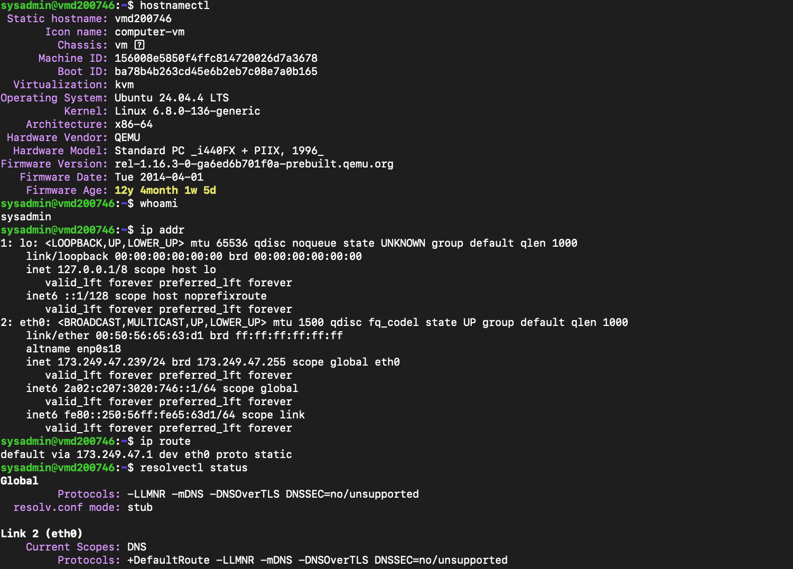
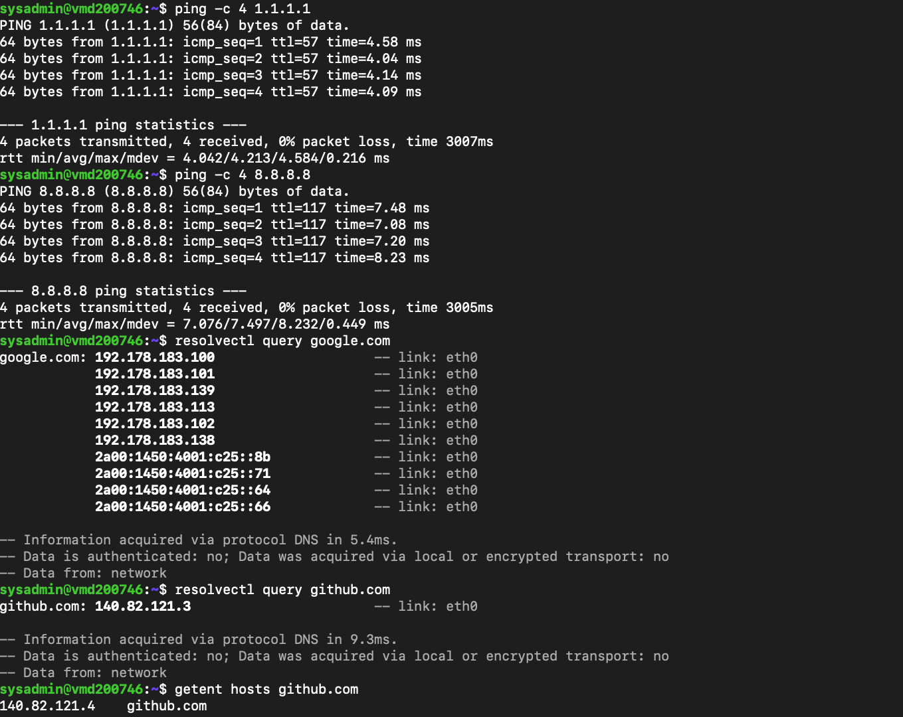
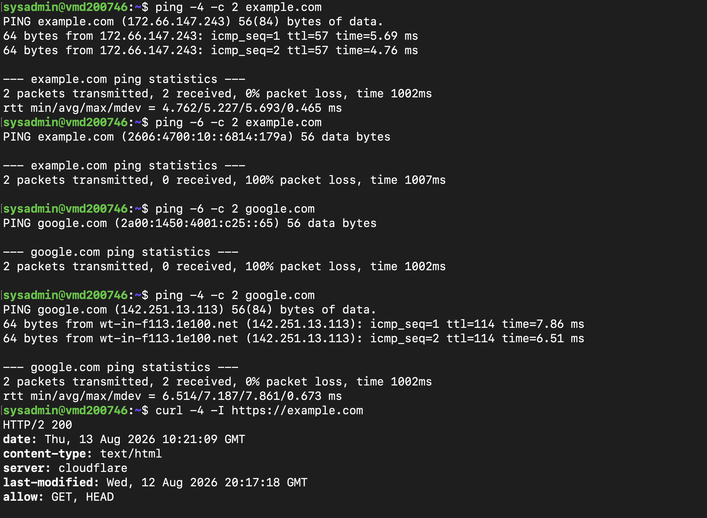
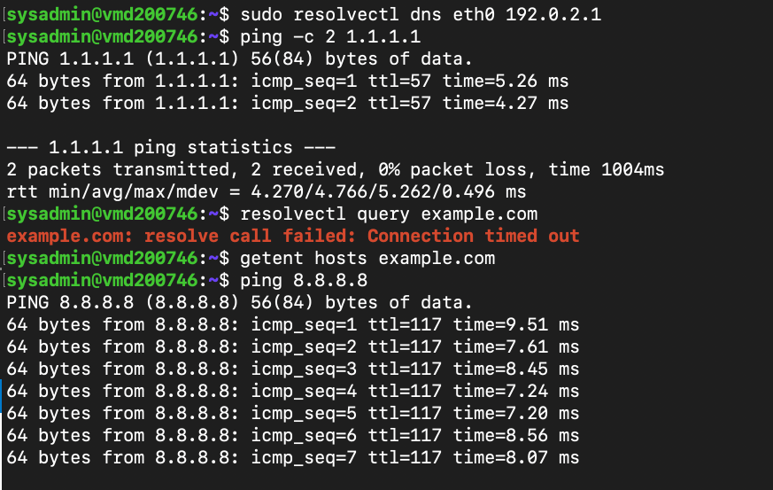

# Lab 13 — Linux Network & DNS Troubleshooting

## Overview

In this lab, I continued building on the Linux system administration foundation from the previous labs by focusing on **network configuration, connectivity, DNS resolution, IPv4/IPv6 behaviour, and HTTPS connectivity**.

The goal was not simply to confirm that the server had internet access. I wanted to understand how to troubleshoot a situation where something appears to be wrong and determine **which layer is actually responsible before making any changes**.

I also created a controlled DNS failure so I could practise the complete troubleshooting cycle:

**baseline → failure → investigation → root cause → recovery → verification**

The most useful lesson from this lab was that a failed `ping` does not automatically mean the network or application is broken.

---

# 1. Reviewing the Server Network Configuration

I started by identifying the server and reviewing its current network configuration.

I checked:

```bash
hostnamectl
whoami
ip addr
ip route
resolvectl status
```

The server is running:

- Ubuntu 24.04.4 LTS
- Linux kernel 6.8
- x86-64 architecture
- KVM virtualisation

The primary network interface is:

```text
eth0
```

with the IPv4 address:

```text
173.249.47.239/24
```

The server also has an IPv6 address configured.

The default route was:

```text
default via 173.249.47.1 dev eth0
```

This gave me the basic network information I needed before testing connectivity.

---

# 2. Validating External Network Connectivity

Before investigating DNS, I wanted to determine whether the server could actually communicate with the internet using IP addresses.

I tested two independent public IP addresses:

```bash
ping -c 4 1.1.1.1
```

and:

```bash
ping -c 4 8.8.8.8
```

Both tests were successful with:

```text
0% packet loss
```

This established that the server had working external IPv4 connectivity.

At this point I could reasonably rule out a basic network connectivity problem.

---

# 3. Reviewing DNS Configuration

Next, I investigated how DNS was configured on the server.

I used:

```bash
resolvectl status
```

The server was using `systemd-resolved`.

The configured DNS servers were:

```text
195.179.224.53
209.126.15.53
```

I also checked:

```bash
cat /etc/resolv.conf
```

The file showed:

```text
nameserver 127.0.0.53
```

and identified itself as a dynamically managed configuration for `systemd-resolved`.

This was an important observation because it showed that `/etc/resolv.conf` was **not the appropriate place to manually change the upstream DNS servers** in this configuration.

Instead, the resolver was using the local `systemd-resolved` stub.

---

# 4. Testing DNS Resolution

I then tested hostname resolution directly.

For example:

```bash
resolvectl query google.com
```

and:

```bash
resolvectl query github.com
```

Both successfully returned IP addresses.

I also used:

```bash
getent hosts github.com
```

which successfully returned:

```text
140.82.121.4 github.com
```

This confirmed that DNS resolution was working correctly.

---

# 5. Testing HTTPS Connectivity

After confirming DNS resolution, I wanted to make sure the server could actually use the resolved addresses to reach external web services.

I tested:

```bash
curl -I https://google.com
```

The response was:

```text
HTTP/2 301
```

The redirect was expected because Google redirected the request to `www.google.com`.

I then tested:

```bash
curl -I https://github.com
```

which returned:

```text
HTTP/2 200
```

I also explicitly tested IPv4:

```bash
curl -4 -I https://google.com
```

which successfully returned:

```text
HTTP/2 301
```

At this stage, I had confirmed:

```text
Network connectivity       ✅
DNS resolution             ✅
HTTPS connectivity         ✅
```

---

# 6. Investigating an Unexpected IPv6 Result

While testing:

```bash
ping -c 2 example.com
```

I noticed something unexpected.

The hostname resolved successfully, but `ping` selected an IPv6 address and received:

```text
100% packet loss
```

Instead of immediately assuming IPv6 was broken, I separated IPv4 and IPv6 testing.

I ran:

```bash
ping -4 -c 2 example.com
```

The IPv4 test succeeded with:

```text
0% packet loss
```

I then tested IPv6:

```bash
ping -6 -c 2 example.com
```

which again showed:

```text
100% packet loss
```

I repeated the comparison with Google.

IPv6 ICMP failed, while IPv4 ICMP succeeded.

This gave me an important question:

> Was IPv6 actually broken, or was ICMP simply not receiving replies?

---

# 7. Testing the Actual Application Over IPv6

Rather than relying only on `ping`, I tested the actual HTTPS service over IPv6.

I ran:

```bash
curl -6 -I https://example.com
```

The request succeeded:

```text
HTTP/2 200
```

I then performed a more detailed test:

```bash
curl -6 -vI https://example.com 2>&1 | grep -E 'Connected|SSL connection|HTTP/'
```

The output confirmed:

```text
Connected to example.com ... port 443
SSL connection using TLSv1.3
using HTTP/2
HTTP/2 200
```

This was the key finding.

Although IPv6 ICMP echo requests were not receiving replies, **IPv6 HTTPS connectivity was working correctly**.

I therefore did not make unnecessary changes to the IPv6 configuration.

---

# 8. Creating a Controlled DNS Failure

After establishing the known-good baseline, I wanted to practise an actual DNS troubleshooting scenario rather than only testing successful connectivity.

Before making the change, I recorded the existing DNS configuration:

```bash
sudo resolvectl dns eth0
```

which confirmed:

```text
195.179.224.53
209.126.15.53
```

I then temporarily configured an intentionally invalid DNS server:

```bash
sudo resolvectl dns eth0 192.0.2.1
```

The purpose was to simulate a DNS outage while leaving the underlying network connection untouched.

---

# 9. Investigating the Simulated DNS Failure

After changing the DNS configuration, I tested IP connectivity again.

The server could still reach an external IP address:

```bash
ping 8.8.8.8
```

This showed that the underlying network connection was still functioning.

However, DNS resolution failed.

For example:

```bash
resolvectl query example.com
```

timed out.

Likewise:

```bash
getent hosts example.com
```

did not return an address.

This gave me a clear comparison:

| Test | Result |
|---|---|
| IP connectivity | Successful |
| DNS resolution | Failed |
| Network interface | Working |
| Default route | Working |

This allowed me to isolate the problem to the **DNS layer** rather than the general network connection.

---

# 10. Restoring the DNS Configuration

Because I had recorded the original configuration before making the change, I did not have to guess which DNS servers should be restored.

I restored the original configuration:

```bash
sudo resolvectl dns eth0 195.179.224.53 209.126.15.53
```

I then checked the resolver state again:

```bash
resolvectl status
```

The original DNS servers were present again.

---

# 11. Verifying DNS Recovery

After restoring the configuration, I tested DNS resolution again:

```bash
resolvectl query example.com
```

The hostname successfully resolved.

I then verified application connectivity:

```bash
curl -4 -I https://example.com
```

The server successfully received:

```text
HTTP/2 200
```

This confirmed that the DNS configuration had been restored and that hostname-based HTTPS connectivity was working again.

---

# 12. Troubleshooting Summary

| Check | Result | Finding |
|---|---|---|
| Network interface | Successful | `eth0` operational |
| IP configuration | Validated | IPv4 and IPv6 configured |
| Default route | Validated | Gateway available |
| IPv4 connectivity | Successful | External network reachable |
| DNS resolution | Successful initially | Resolver working |
| HTTPS connectivity | Successful | External services reachable |
| IPv6 ping | Failed | ICMPv6 received no replies |
| IPv6 HTTPS | Successful | IPv6 application connectivity working |
| Simulated DNS failure | Reproduced | Hostname resolution failed |
| IP connectivity during DNS failure | Successful | Network itself remained operational |
| DNS restoration | Successful | Original resolvers restored |
| Final DNS test | Successful | Name resolution recovered |
| Final HTTPS test | Successful | Application connectivity restored |

---

# Key Lesson

The biggest lesson from this lab was **not to treat every failed command as evidence that something is broken**.

When IPv6 `ping` failed, I initially had an unexpected result. Instead of changing the network configuration, I tested IPv4, IPv6 and the actual HTTPS service.

The result showed that IPv6 application connectivity was working even though ICMPv6 wasn't returning replies.

The DNS exercise reinforced the same principle.

When I deliberately broke DNS, the server could still reach external IP addresses, but hostname resolution failed. That allowed me to isolate the problem to DNS rather than incorrectly troubleshooting the network itself.

The troubleshooting process became:

```text
Observe
   ↓
Form a hypothesis
   ↓
Test the hypothesis
   ↓
Compare the evidence
   ↓
Make the smallest appropriate change
   ↓
Verify the result
```

That is the approach I want to carry into real IT Support and System Administration work.

---

# What I Learned

This lab helped me become more comfortable with several Linux networking tools:

- `ip addr`
- `ip route`
- `ping`
- `resolvectl`
- `getent`
- `curl`
- `hostnamectl`

More importantly, I learned how to use them together rather than treating them as isolated commands.

I also learned that DNS configuration should not simply be changed manually without understanding **what manages the configuration**.

In a production environment, DNS may be supplied through DHCP, a cloud provider, NetworkManager, systemd-networkd, configuration management, or an organisation's internal DNS infrastructure.

The correct approach is to first determine **what the system is supposed to use**, rather than guessing at a replacement DNS server.

---

# Skills Demonstrated

- Performed structured Linux network troubleshooting
- Validated IPv4 and IPv6 connectivity
- Investigated routing and interface configuration
- Troubleshot DNS using `systemd-resolved`
- Used `resolvectl` and `getent` to validate hostname resolution
- Tested application-layer HTTPS connectivity with `curl`
- Distinguished ICMP failure from application connectivity
- Simulated a controlled DNS outage
- Isolated DNS failure from general network connectivity
- Restored a known-good DNS configuration
- Verified service recovery after remediation
- Documented investigation, findings, root cause, resolution and verification
- Applied a structured troubleshooting methodology

---

# Screenshots

I kept the screenshots limited to the parts that best tell the story of the investigation. The five screenshots follow the lab from the initial network baseline through troubleshooting, the controlled DNS failure, and final recovery.

## Screenshot 1 — Network and DNS Baseline



This screenshot captures the initial state of the Ubuntu server before making any changes.

It shows:

```bash
hostnamectl
whoami
ip addr
ip route
resolvectl status
```

The screenshot provides evidence of:

- The Ubuntu server and system environment
- The active `eth0` network interface
- The server's IPv4 and IPv6 configuration
- The default gateway
- The DNS servers currently assigned to `eth0`
- The use of `systemd-resolved`

This established the **known-good baseline** that I used throughout the investigation.

---

## Screenshot 2 — Connectivity and DNS Verification



This screenshot shows that the server was initially able to communicate with external systems and resolve hostnames successfully.

It includes:

```bash
ping -c 4 1.1.1.1
ping -c 4 8.8.8.8
resolvectl query google.com
resolvectl query github.com
getent hosts github.com
```

The evidence demonstrates that:

- External IPv4 connectivity was working
- DNS resolution was working
- The configured resolver could successfully resolve public domains
- The server was able to obtain both IPv4 and IPv6 addresses where available

This established that there was **no general network or DNS problem before the investigation**.

---

## Screenshot 3 — IPv4/IPv6 Investigation



This screenshot captures the unexpected result that led to further investigation.

It shows the comparison between IPv4 and IPv6 connectivity:

```bash
ping -4 -c 2 example.com
ping -6 -c 2 example.com
ping -4 -c 2 google.com
ping -6 -c 2 google.com
```

It also includes the IPv6 application-layer test:

```bash
curl -6 -vI https://example.com 2>&1 | grep -E 'Connected|SSL connection|HTTP/'
```

The important evidence is:

- IPv4 ping succeeded
- IPv6 ping received no ICMP replies
- IPv6 HTTPS connectivity succeeded
- TLS 1.3 was successfully negotiated
- HTTP/2 returned `HTTP/2 200`

This showed that the failed IPv6 `ping` did **not** mean that IPv6 application connectivity was broken.

Instead of changing the IPv6 configuration unnecessarily, I used additional testing to determine what the result actually meant.

---

## Screenshot 4 — Controlled DNS Failure



This screenshot documents the controlled DNS failure that I introduced after establishing the known-good baseline.

It shows the temporary DNS configuration change:

```bash
sudo resolvectl dns eth0 192.0.2.1
```

followed by the troubleshooting tests:

```bash
ping 8.8.8.8
resolvectl query example.com
getent hosts example.com
```

The evidence demonstrates that:

- IP connectivity remained available
- The network interface and route were still functioning
- DNS queries timed out
- Hostname resolution failed

This allowed me to isolate the simulated problem to the **DNS layer rather than the underlying network connection**.

---

## Screenshot 5 — DNS Restoration and Final Verification


This screenshot shows the recovery process and final verification.

It includes the restoration of the original known-good DNS configuration:

```bash
sudo resolvectl dns eth0 195.179.224.53 209.126.15.53
```

followed by:

```bash
resolvectl status
resolvectl query example.com
curl -4 -I https://example.com
```

The screenshot provides evidence that:

- The original DNS servers were restored
- `systemd-resolved` was using the correct configuration again
- `example.com` could be resolved successfully
- HTTPS connectivity was restored
- The web server returned:

```text
HTTP/2 200
```

This completed the troubleshooting cycle:

```text
Known-good baseline
        ↓
Controlled DNS failure
        ↓
Evidence collection
        ↓
Fault isolation
        ↓
DNS restoration
        ↓
Final verification
```
---

# Final Thoughts

This lab started as a simple networking exercise, but the most useful part ended up being the troubleshooting.

I expected the main task to be checking whether the server could reach the internet and resolve domain names. Instead, I encountered an unexpected IPv6 `ping` result and had to investigate what it actually meant.

The answer wasn't to immediately change something.

The same thing happened with DNS. I deliberately introduced a failure, but because I had recorded the original configuration first, I could safely investigate the problem and restore the server without guessing.

That reinforced something I'm learning throughout these Linux labs:

> **A good technician doesn't just know which command to run. They know what question the command is supposed to answer.**

That is the mindset I want to keep developing as I move into web servers, SSL, reverse proxies, containers, automation and monitoring.

---

# Next

With the networking and DNS troubleshooting foundation in place, the next stage of the roadmap will move into **web servers and HTTP services**, followed by SSL/TLS, reverse proxies, containers, automation and monitoring.

