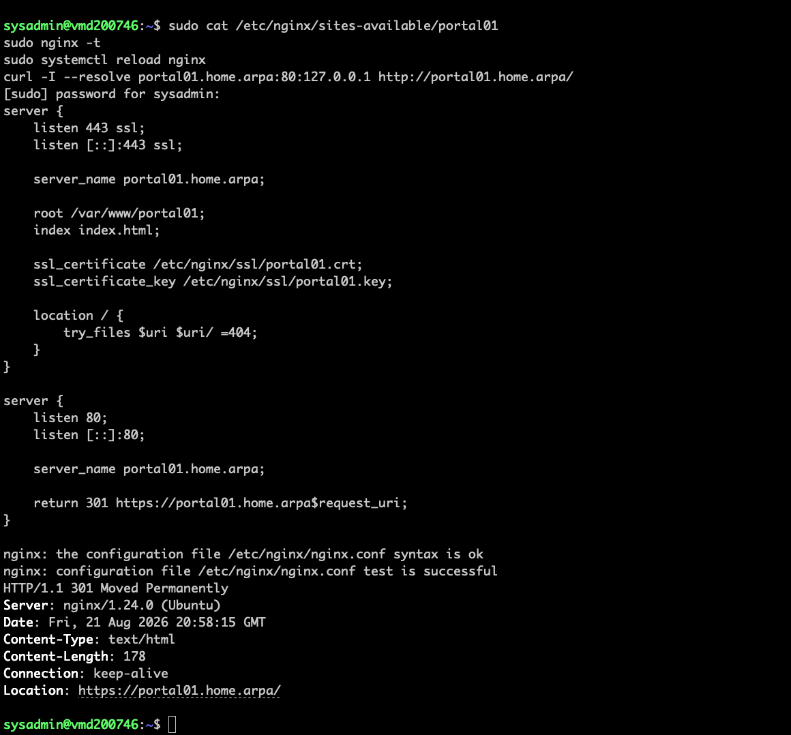
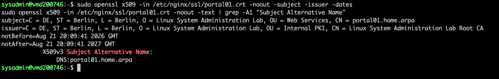
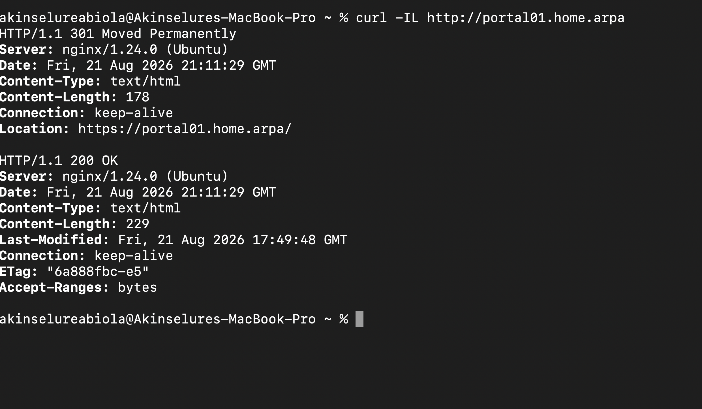

# Lab 14 – Nginx HTTPS, Internal CA & HTTP-to-HTTPS Redirect

---

# Overview

In this lab, I continued building on the Nginx web server work from the previous lab. This time, I wanted to take the website one step further by moving it from plain HTTP to HTTPS.

The goal was not just to make the browser show a padlock. I wanted to understand what actually happens when a browser connects securely to a web server, how certificates work, how a Certificate Authority (CA) fits into the process, and how Nginx uses a certificate and private key to provide HTTPS.

I also wanted to make the setup feel more like a real internal environment. Instead of using a public certificate authority, I created my own internal CA for the lab and used it to sign the certificate for:

```text
portal01.home.arpa
```

There was also a useful troubleshooting moment during the lab. The first certificate I created did not contain the required Subject Alternative Name (SAN), which caused Chrome to report a certificate name error. I regenerated the certificate with the correct SAN, trusted my internal CA on macOS, and the site eventually loaded correctly over HTTPS.

Finally, I configured Nginx to redirect HTTP traffic on port 80 to HTTPS on port 443.

This lab was probably the first time I felt like I was putting several of the earlier Linux administration concepts together into an actual web service.

---

# Objectives

The goals of this lab were to:

- Understand the difference between HTTP and HTTPS
- Understand how TLS certificates are used by web servers
- Create a private/internal Certificate Authority
- Generate a server certificate for an internal hostname
- Understand the role of a Certificate Signing Request (CSR)
- Configure Nginx to use HTTPS
- Install and trust the internal CA certificate on macOS
- Troubleshoot certificate trust and hostname errors
- Understand Subject Alternative Names (SANs)
- Configure HTTP-to-HTTPS redirection
- Validate the final configuration using `curl`
- Understand how Nginx, certificates and hostnames work together

---

# Environment

- Operating System: Ubuntu Server 24.04 LTS
- Host: Contabo VPS
- Web Server: Nginx
- Access Method: SSH from macOS Terminal
- Administrator Account: `sysadmin`
- Client: macOS with Google Chrome
- Internal Website: `portal01.home.arpa`
- HTTP Port: `80`
- HTTPS Port: `443`

---

# Part 1 – Reviewing the Existing Nginx Website

I started with the Nginx website I had created in the previous web server lab.

The site was already working over HTTP, so I first checked the existing Nginx configuration.

```bash
sudo cat /etc/nginx/sites-available/portal01
```

The HTTPS server block used:

```nginx
server {
    listen 443 ssl;
    listen [::]:443 ssl;

    server_name portal01.home.arpa;

    root /var/www/portal01;
    index index.html;

    ssl_certificate /etc/nginx/ssl/portal01.crt;
    ssl_certificate_key /etc/nginx/ssl/portal01.key;

    location / {
        try_files $uri $uri/ =404;
    }
}
```

This tells Nginx to listen for HTTPS traffic on port `443` and use the certificate and private key stored under `/etc/nginx/ssl/`.

---

# Part 2 – Creating an Internal Certificate Authority

For this lab, I decided to create my own internal Certificate Authority instead of using a public CA.

I created a dedicated directory:

```bash
sudo mkdir -p /root/lab-ca
```

The basic relationship was:

```text
Internal Root CA
       |
       | signs
       v
portal01.home.arpa certificate
       |
       v
Nginx
       |
       v
HTTPS website
```

This helped me understand that the server certificate is part of a chain of trust rather than just a file that enables HTTPS.

The important CA files were:

```text
lab-ca.key
lab-ca.crt
```

The CA private key needed to be protected because anyone who obtains it could potentially create certificates that appear trusted by systems that trust this CA.

---

# Part 3 – Creating the Server Certificate Request

Next, I created a Certificate Signing Request (CSR) for the Nginx server.

The hostname was:

```text
portal01.home.arpa
```

The CSR contained identity information including:

```text
C = DE
ST = Berlin
L = Berlin
O = Linux System Administration Lab
OU = Web Services
CN = portal01.home.arpa
```

The important distinction I learned here is that the CSR is a request for a certificate. It is not the final server certificate.

The process is roughly:

```text
Server private key
        |
        v
       CSR
        |
        | signed by CA
        v
Server certificate
```

---

# Part 4 – The First Certificate Problem

At first, I created the server certificate without properly including a Subject Alternative Name.

When I tested the website in Chrome, I received:

```text
NET::ERR_CERT_AUTHORITY_INVALID
```

The first problem was that my Mac did not yet trust the internal CA.

I opened the CA certificate in macOS Keychain Access and imported it into the login keychain.

The certificate initially showed:

```text
This root certificate is not trusted
```

I opened its Trust settings and changed:

```text
When using this certificate:
Use System Defaults
```

to:

```text
Always Trust
```

macOS then asked for my account password before applying the trust settings.

Afterwards, Keychain Access showed:

```text
This certificate is marked as trusted for this account
```

---

# Part 5 – Understanding the SAN Problem

After trusting the CA, Chrome still reported a certificate error.

The error changed to:

```text
NET::ERR_CERT_COMMON_NAME_INVALID
```

This was a useful clue. The problem was no longer simply that the CA was untrusted. The certificate itself did not correctly identify the hostname being requested.

Modern TLS certificate validation relies heavily on the Subject Alternative Name (SAN) extension.

For this website, the certificate needed:

```text
DNS:portal01.home.arpa
```

This was a good troubleshooting lesson because the browser error changed as I fixed one part of the certificate configuration.

---

# Part 6 – Creating the Certificate Extensions File

I created an OpenSSL extensions file:

```bash
sudo tee /root/lab-ca/portal01-ext.cnf > /dev/null <<'EOF'
basicConstraints=CA:FALSE
keyUsage=digitalSignature,keyEncipherment
extendedKeyUsage=serverAuth
subjectAltName=DNS:portal01.home.arpa
EOF
```

The most important line for the hostname problem was:

```text
subjectAltName=DNS:portal01.home.arpa
```

The other settings describe how the certificate is intended to be used:

```text
basicConstraints=CA:FALSE
```

means this is a server certificate, not another CA certificate.

```text
extendedKeyUsage=serverAuth
```

indicates that the certificate is intended for server authentication.

---

# Part 7 – Signing the Server Certificate

I then signed the CSR using my internal CA:

```bash
sudo openssl x509 -req   -in /root/lab-ca/portal01.csr   -CA /root/lab-ca/lab-ca.crt   -CAkey /root/lab-ca/lab-ca.key   -CAcreateserial   -out /etc/nginx/ssl/portal01.crt   -days 365   -sha256   -extfile /root/lab-ca/portal01-ext.cnf
```

OpenSSL confirmed:

```text
Certificate request self-signature ok
```

The resulting server certificate was written to:

```text
/etc/nginx/ssl/portal01.crt
```

---

# Part 8 – Verifying the Subject Alternative Name

Before testing the browser again, I wanted to verify the certificate directly instead of guessing.

```bash
sudo openssl x509 -in /etc/nginx/ssl/portal01.crt -noout -text | grep -A1 "Subject Alternative Name"
```

The output showed:

```text
X509v3 Subject Alternative Name:
    DNS:portal01.home.arpa
```

This was the confirmation I needed.

The certificate now contained the hostname that the browser was actually requesting.

---

# Part 9 – Testing HTTPS

After regenerating the certificate and trusting the internal CA, I opened:

```text
https://portal01.home.arpa
```

The website loaded successfully.

The page displayed:

```text
Linux Web Server Lab

Nginx is serving my own website.

This page is being served by Ubuntu and Nginx.
```

This confirmed that Nginx, port 443, the certificate, the hostname and the local trust relationship were all working together.

---

# Part 10 – Understanding HTTP vs HTTPS

Before configuring the redirect, I wanted to make sure I understood why both HTTP and HTTPS exist.

HTTP normally uses:

```text
Port 80
```

HTTPS normally uses:

```text
Port 443
```

HTTP sends web traffic without TLS encryption, while HTTPS adds TLS protection to the HTTP connection.

A simplified comparison is:

```text
HTTP
Browser
   |
   | Plain HTTP
   |
   v
Nginx :80
```

versus:

```text
HTTPS
Browser
   |
   | TLS + HTTP
   |
   v
Nginx :443
```

HTTPS provides confidentiality and integrity for the connection and allows the client to authenticate the server through certificates.

HTTP is still useful because a client may initially request the old HTTP URL. The web server can respond by telling the client to use HTTPS instead.

That is where the redirect comes in.

---

# Part 11 – Configuring HTTP-to-HTTPS Redirection

I updated the Nginx configuration so that HTTP requests are redirected to HTTPS.

The intended flow was:

```text
http://portal01.home.arpa
             |
             | 301 redirect
             v
https://portal01.home.arpa
```

The HTTP server block listens on port 80 and redirects the request.

The HTTPS server block listens on port 443 and serves the actual website.

So Nginx is handling both ports, but they have different jobs:

```text
Port 80
   |
   +---- Redirect to HTTPS

Port 443
   |
   +---- Serve the website securely
```

---

# Part 12 – Testing the Nginx Configuration

Before reloading Nginx, I checked the configuration:

```bash
sudo nginx -t
```

The result was:

```text
nginx: the configuration file /etc/nginx/nginx.conf syntax is ok
nginx: configuration file /etc/nginx/nginx.conf test is successful
```

I then reloaded Nginx:

```bash
sudo systemctl reload nginx
```

Using reload instead of restart allowed the configuration to be applied without unnecessarily stopping the service.

---

# Part 13 – Verifying the HTTP Redirect

I first tested the redirect directly from the server:

```bash
curl -I --resolve portal01.home.arpa:80:127.0.0.1 http://portal01.home.arpa/
```

The response was:

```text
HTTP/1.1 301 Moved Permanently
Server: nginx/1.24.0 (Ubuntu)
Location: https://portal01.home.arpa/
```

I then tested from my Mac:

```bash
curl -I http://portal01.home.arpa
```

Again, the response showed:

```text
HTTP/1.1 301 Moved Permanently
Location: https://portal01.home.arpa/
```

Finally, I followed the redirect:

```bash
curl -IL http://portal01.home.arpa
```

The result showed:

```text
HTTP/1.1 301 Moved Permanently
Location: https://portal01.home.arpa/
```

followed by:

```text
HTTP/1.1 200 OK
```

This confirmed that the complete flow was working:

```text
HTTP request
     |
     v
301 redirect
     |
     v
HTTPS request
     |
     v
200 OK
```

---

# What I Learned

This lab helped me connect several concepts that I had previously understood separately.

I started with a basic Nginx website and ended with a working HTTPS site using a certificate signed by my own internal CA.

The biggest lesson for me was that HTTPS is not simply "turning on encryption." There are several pieces involved:

```text
Hostname
   +
Server private key
   +
CSR
   +
Certificate
   +
Certificate Authority
   +
Client trust
   +
Nginx configuration
   =
Working HTTPS
```

I also learned that certificate errors can be very specific.

The first error was:

```text
NET::ERR_CERT_AUTHORITY_INVALID
```

which pointed me toward the trust relationship.

After trusting the CA, the error became:

```text
NET::ERR_CERT_COMMON_NAME_INVALID
```

which pointed toward the certificate identity.

That eventually led me to the missing SAN:

```text
DNS:portal01.home.arpa
```

Seeing the errors change as I fixed each part made certificate troubleshooting much easier to understand.

Another thing I learned is that the browser is only one part of troubleshooting. Commands such as `openssl` and `curl` gave me much more direct information about what was actually happening.

---

# Key Commands

```bash
# Check Nginx configuration
sudo nginx -t

# Reload Nginx
sudo systemctl reload nginx

# Inspect a certificate
sudo openssl x509 -in /etc/nginx/ssl/portal01.crt -noout -text

# Check the certificate SAN
sudo openssl x509 -in /etc/nginx/ssl/portal01.crt -noout -text | grep -A1 "Subject Alternative Name"

# Test HTTP headers
curl -I http://portal01.home.arpa

# Follow the redirect
curl -IL http://portal01.home.arpa

# Test the local HTTP listener
curl -I --resolve portal01.home.arpa:80:127.0.0.1 http://portal01.home.arpa/
```

---

# Troubleshooting

## Chrome Reported `NET::ERR_CERT_AUTHORITY_INVALID`

The initial HTTPS connection failed because the Mac did not trust my internal CA.

I opened the CA certificate in Keychain Access and changed its trust setting to:

```text
Always Trust
```

macOS required my account password before applying the change.

After that, the CA was marked as trusted for my account.

---

## Chrome Then Reported `NET::ERR_CERT_COMMON_NAME_INVALID`

After fixing the CA trust issue, Chrome still rejected the certificate.

This time the problem was the certificate identity.

The certificate did not contain the required Subject Alternative Name for:

```text
portal01.home.arpa
```

I created the extensions file with:

```text
subjectAltName=DNS:portal01.home.arpa
```

and regenerated the server certificate.

I then verified the SAN directly with OpenSSL.

---

## The Browser Was Not the Best Troubleshooting Tool

At one point, I suspected the certificate trust changes had not "synced" to Chrome.

The better approach was to stop relying on the browser alone and test the actual server response with `curl`.

The final test:

```bash
curl -IL http://portal01.home.arpa
```

returned:

```text
301 Moved Permanently
```

followed by:

```text
200 OK
```

So the server-side configuration was working correctly.

This was a good reminder that when a browser behaves unexpectedly, testing the service directly from the command line can save a lot of time.

---

# Screenshots

### 1. Nginx HTTPS Configuration and HTTP Redirect

This screenshot shows the final Nginx configuration, successful configuration test, reload, and the HTTP `301` redirect to HTTPS.



---

### 2. Certificate and Subject Alternative Name Verification

This screenshot shows the certificate details, including the issuer, validity period, and the required Subject Alternative Name for `portal01.home.arpa`.



---

### 3. Final HTTP-to-HTTPS Verification

This screenshot shows the complete HTTP-to-HTTPS flow using `curl -IL`, where the HTTP request receives a `301 Moved Permanently` response and is followed by a successful `200 OK` HTTPS response.



---

# Final Thoughts

This lab was a really useful step because it moved the web server from simply "serving a webpage" to actually serving it securely.

The certificate troubleshooting was probably the most valuable part for me. I initially thought that once I imported the CA certificate into Keychain Access, HTTPS should immediately work. Instead, I had to separate the problem into trust and certificate identity.

The SAN issue in particular helped me understand something that I had previously only seen mentioned in documentation.

I also liked seeing the final redirect work from the command line:

```text
HTTP
  |
  | 301
  v
HTTPS
  |
  | 200
  v
Website
```

At this point, I have a much better understanding of what happens between typing a URL into a browser and actually receiving a webpage from Nginx.

---

# Next Steps

The next stage of the web server work can build on this setup by looking at:

- Reviewing the final Nginx virtual host configuration
- Understanding certificate renewal and expiration
- Exploring the full TLS certificate chain
- Testing Nginx access and error logs
- Reviewing HTTP security headers
- Understanding how DNS, virtual hosts and TLS work together
- Looking at how a production environment would use a public CA such as Let's Encrypt
- Continuing with additional Linux networking and web server administration exercises

This lab also gives me a good foundation for understanding more advanced reverse proxy and web infrastructure setups later in the project.