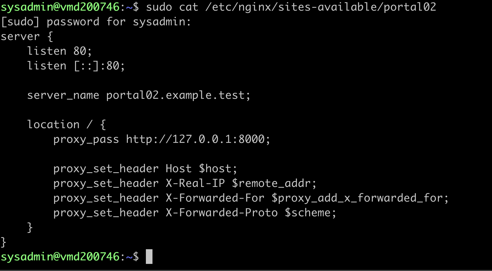
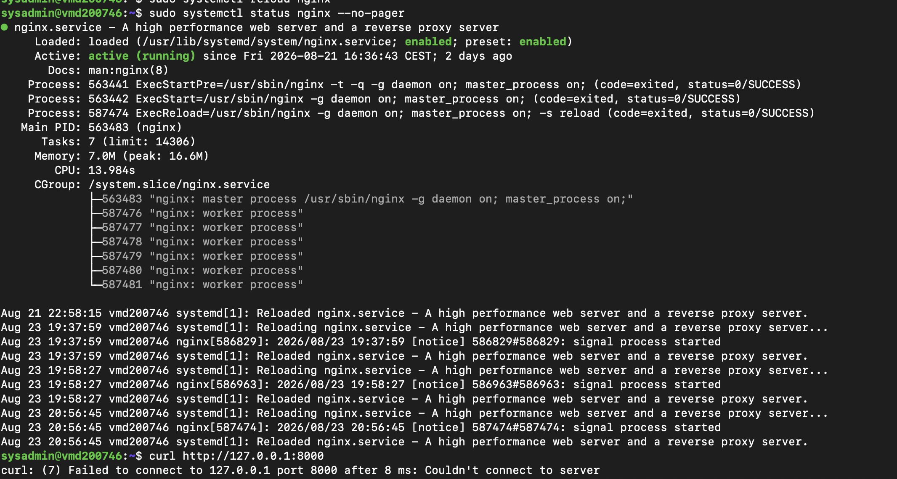
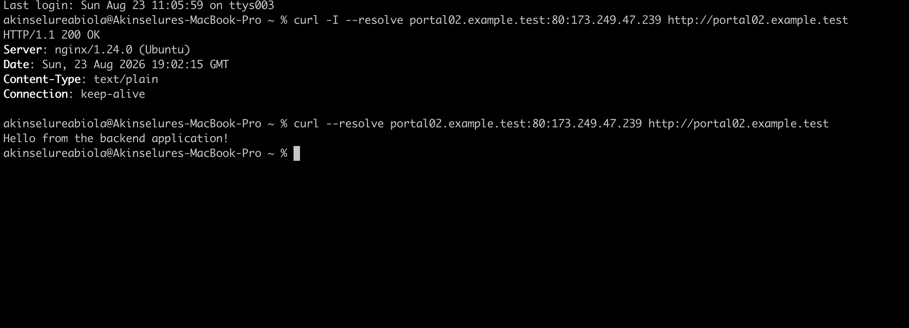
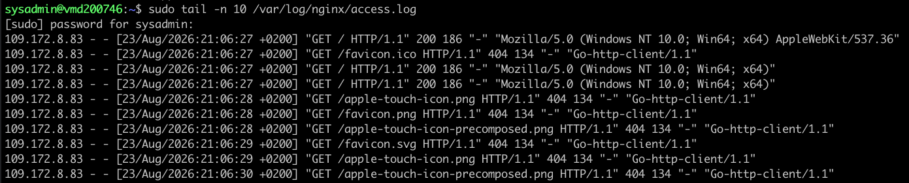

# Nginx Reverse Proxy Lab

## Overview

In this lab, I configured Nginx as a reverse proxy for a locally hosted Python backend application.

The purpose of this lab was to understand how Nginx can act as the public facing web server while forwarding requests to an application running on a private local port.

The final architecture was:

```text
Mac
 ↓
Nginx :80
 ↓
Reverse Proxy
 ↓
127.0.0.1:8000
 ↓
Python Backend Application
```

The backend application was intentionally kept simple so that the focus remained on Nginx and reverse proxy administration.

---

## Objectives

The objectives of this lab were to:

* Create a simple backend application.
* Run the backend application on a local interface.
* Verify that the backend works independently.
* Configure Nginx to act as a reverse proxy.
* Validate the Nginx configuration.
* Reload Nginx safely.
* Test the reverse proxy from an external client.
* Inspect Nginx access logs.
* Troubleshoot a 502 Bad Gateway error.

---

## Environment

### Server

* Provider: Contabo
* Operating System: Ubuntu 24.04.4 LTS
* Public IPv4: 173.249.47.239
* Web Server: Nginx 1.24.0
* Backend: Python 3.12.3

### Client

* macOS
* curl 8.7.1

### Existing Infrastructure

The VPS already had:

* SSH configured and hardened
* Nginx installed
* HTTP on port 80
* HTTPS on port 443
* Existing Nginx virtual hosts
* Local hostname resolution configured on the Mac for the lab hostname

---

# 1. Understanding the Reverse Proxy Architecture

Before configuring the reverse proxy, I created a simple backend application.

The purpose was to simulate an application such as an API, web application, or service that would normally run behind Nginx.

The Python application listens only on:

```text
127.0.0.1:8000
```

This means the backend application is not directly exposed to the public network.

Nginx becomes the public entry point.

---

# 2. Creating the Backend Application

I created a working directory:

```bash
mkdir -p ~/reverse-proxy-lab
cd ~/reverse-proxy-lab
```

I then created the Python application:

```bash
nano app.py
```

The application uses Python's built in HTTP server functionality.

```python
from http.server import BaseHTTPRequestHandler, HTTPServer

class Handler(BaseHTTPRequestHandler):

    def do_HEAD(self):
        self.send_response(200)
        self.send_header("Content-Type", "text/plain")
        self.end_headers()

    def do_GET(self):
        response = b"Hello from the backend application!\n"

        self.send_response(200)
        self.send_header("Content-Type", "text/plain")
        self.send_header("Content-Length", str(len(response)))
        self.end_headers()
        self.wfile.write(response)

server = HTTPServer(("127.0.0.1", 8000), Handler)

print("Backend running on http://127.0.0.1:8000")

server.serve_forever()
```

The application was started with:

```bash
python3 app.py
```

The application reported:

```text
Backend running on http://127.0.0.1:8000
```

---

# 3. Testing the Backend Directly

Before involving Nginx, I tested the backend directly:

```bash
curl http://127.0.0.1:8000
```

The response was:

```text
Hello from the backend application!
```

I also tested the HTTP HEAD method:

```bash
curl -I http://127.0.0.1:8000
```

The backend initially returned:

```text
HTTP/1.0 501 Unsupported method ('HEAD')
```

This happened because the initial application implemented GET but did not implement HEAD.

I added a `do_HEAD()` method and tested again.

The result was:

```text
HTTP/1.0 200 OK
```

This confirmed that the backend supported both GET and HEAD requests.

---

# 4. Checking Existing Nginx Configuration

Before modifying the existing `portal02` virtual host, I inspected its configuration:

```bash
sudo cat /etc/nginx/sites-available/portal02
```

The original configuration served static files from:

```text
/var/www/portal02
```

I decided to reuse this virtual host for the reverse proxy exercise.

---

# 5. Creating a Configuration Backup

Before making changes, I created a backup:

```bash
sudo cp /etc/nginx/sites-available/portal02 \
/etc/nginx/sites-available/portal02.backup
```

The backup was verified with:

```bash
sudo ls -la /etc/nginx/sites-available/portal02*
```

The original configuration and backup were both present.

This provided a recovery point before changing the web server configuration.

---

# 6. Configuring Nginx as a Reverse Proxy

I edited:

```bash
sudo nano /etc/nginx/sites-available/portal02
```

The configuration was changed to:

```nginx
server {
    listen 80;
    listen [::]:80;

    server_name portal02.example.test;

    location / {
        proxy_pass http://127.0.0.1:8000;

        proxy_set_header Host $host;
        proxy_set_header X-Real-IP $remote_addr;
        proxy_set_header X-Forwarded-For $proxy_add_x_forwarded_for;
        proxy_set_header X-Forwarded-Proto $scheme;
    }
}
```

The key directive is:

```nginx
proxy_pass http://127.0.0.1:8000;
```

This tells Nginx to forward incoming requests to the backend application running on port 8000.

---

# 7. Validating the Nginx Configuration

Before reloading Nginx, I tested the configuration:

```bash
sudo nginx -t
```

The result confirmed:

```text
nginx: the configuration file /etc/nginx/nginx.conf syntax is ok
nginx: configuration file /etc/nginx/nginx.conf test is successful
```

This confirmed that the configuration could be safely loaded.

---

# 8. Reloading Nginx

I reloaded Nginx without stopping the service:

```bash
sudo systemctl reload nginx
```

I then checked the service:

```bash
sudo systemctl status nginx --no-pager
```

The service remained:

```text
Active: active (running)
```

The reload completed successfully.

---

# 9. Troubleshooting 502 Bad Gateway

The first external test from my Mac returned:

```text
HTTP/1.1 502 Bad Gateway
```

This indicated that the request was reaching Nginx, but Nginx could not successfully communicate with the configured upstream backend.

I tested the backend directly on the VPS:

```bash
curl http://127.0.0.1:8000
```

The result was:

```text
curl: (7) Failed to connect to 127.0.0.1 port 8000
```

This identified the problem.

The Python backend application was no longer running.

I started the backend again:

```bash
cd ~/reverse-proxy-lab
python3 app.py
```

I then verified the backend:

```bash
curl http://127.0.0.1:8000
```

The result was:

```text
Hello from the backend application!
```

This restored the upstream service.

---

# 10. Testing the Reverse Proxy

From the Mac, I tested the Nginx virtual host:

```bash
curl -I --resolve portal02.example.test:80:173.249.47.239 \
http://portal02.example.test
```

The response was:

```text
HTTP/1.1 200 OK
Server: nginx/1.24.0 (Ubuntu)
Content-Type: text/plain
```

I then tested the complete GET request:

```bash
curl --resolve portal02.example.test:80:173.249.47.239 \
http://portal02.example.test
```

The backend response was:

```text
Hello from the backend application!
```

This demonstrated that the request was successfully travelling through Nginx to the Python backend.

---

# 11. Verifying the Request in Nginx Logs

I checked the Nginx access log:

```bash
sudo tail -n 5 /var/log/nginx/access.log
```

The relevant entry was:

```text
185.134.129.254 - - [23/Aug/2026:21:14:11 +0200] "GET / HTTP/1.1" 200 36 "-" "curl/8.7.1"
```

The request returned HTTP 200 and the response size was 36 bytes.

The response was:

```text
Hello from the backend application!
```

This provided server side evidence that the external request reached Nginx successfully.

---

# 12. Final Architecture

```text
                    Internet
                       |
                  HTTP :80
                       |
                       v
              +----------------+
              |     Nginx      |
              | Reverse Proxy  |
              +----------------+
                       |
                  proxy_pass
                       |
                       v
              127.0.0.1:8000
                       |
                       v
              +----------------+
              | Python Backend |
              +----------------+
                       |
                       v
       Hello from the backend application!
```

The Python application listens only on the local loopback interface.

Nginx provides the externally accessible entry point.

---

# 13. Troubleshooting Scenario

## Problem

Nginx returned:

```text
HTTP/1.1 502 Bad Gateway
```

## Investigation

I tested the upstream backend directly:

```bash
curl http://127.0.0.1:8000
```

The connection failed.

## Root Cause

The Python backend application was not running.

## Resolution

The backend was started again:

```bash
python3 app.py
```

## Verification

The backend returned:

```text
Hello from the backend application!
```

The external Nginx request then returned:

```text
HTTP/1.1 200 OK
```

This demonstrated the relationship between Nginx and its upstream application.

---

# 14. screenshots

### Nginx Reverse Proxy Configuration



Nginx configured to forward requests from `portal02.example.test` to the local Python backend.

### 502 Bad Gateway Troubleshooting



The upstream Python application was unavailable, causing Nginx to return a 502 Bad Gateway response.

### Successful External Test



The request successfully travelled from the Mac through Nginx to the Python backend and returned HTTP 200.

### Nginx Access Log



The Nginx access log records the successful external request with HTTP 200.

---

# 15. Key Commands

| Command | Purpose |
|---|---|
| `python3 app.py` | Start the backend application |
| `curl http://127.0.0.1:8000` | Test the backend directly |
| `sudo nginx -t` | Validate Nginx configuration |
| `sudo systemctl reload nginx` | Reload Nginx safely |
| `sudo systemctl status nginx` | Check Nginx status |
| `sudo ss -tulpn` | Check listening ports |
| `sudo tail /var/log/nginx/access.log` | Inspect Nginx requests |
| `sudo cp` | Create configuration backups |

---

# 16. What I Learned

This lab helped me understand the practical role of a reverse proxy.

I learned that Nginx does not have to serve the application itself. It can receive requests from clients and forward them to an application running on a private local port.

I also learned how important it is to troubleshoot the complete request path rather than assuming that an Nginx error is necessarily caused by Nginx.

The 502 Bad Gateway scenario demonstrated this clearly. Nginx was running correctly, but the upstream application was unavailable.

I also practised:

* Creating and testing a backend service
* Binding an application to localhost
* Configuring Nginx `proxy_pass`
* Validating Nginx configuration
* Safely reloading Nginx
* Testing services with curl
* Reading Nginx access logs
* Troubleshooting upstream connectivity
* Using configuration backups before making changes

---

# 17. Final Result

The reverse proxy configuration was successfully completed.

The final request path is:

```text
Mac
→ Nginx
→ 127.0.0.1:8000
→ Python backend
```

The backend response was successfully returned to the external client through Nginx.

The lab also included a real troubleshooting scenario involving a 502 Bad Gateway caused by an unavailable upstream application.
